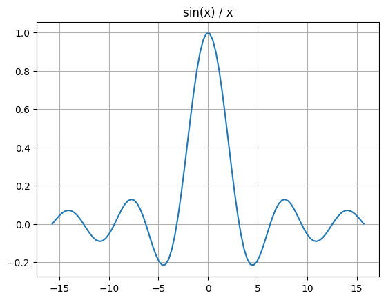

#  _for Pythonistas_

Julia looks and feels a lot like MATLAB and Python! Only much, much faster.

It is dynamic, expressive, extensible.

It is particularly designed for Data Science and Machine Learning.

# Julia REPL

Julia REPL (read-eval-print loop) allows us to:
* write scripts
* execute scripts
* evaluate variables, experessions and functions
* get help
* manage Julia packages (modules) and installations
* access OS sheell


# Julia Help

To get help on any module, function, variable, or just about anything else, just type `?` followed by what you're interested in. 

For example, here is the help for the exponent function (`?exp`).


```julia
?exp
```

    search: exp exp2 Expr expm1 exp10 exp_a export exponent expanduser
    


```
exp(x)
```

Compute the natural base exponential of `x`, in other words $e^x$.

# Examples

```jldoctest
julia> exp(1.0)
2.718281828459045
```

---

```
exp(A::AbstractMatrix)
```

Compute the matrix exponential of `A`, defined by

$$
e^A = \sum_{n=0}^{\infty} \frac{A^n}{n!}.
$$

For symmetric or Hermitian `A`, an eigendecomposition ([`eigen`](@ref)) is used, otherwise the scaling and squaring algorithm (see [^H05]) is chosen.

[^H05]: Nicholas J. Higham, "The squaring and scaling method for the matrix exponential revisited", SIAM Journal on Matrix Analysis and Applications, 26(4), 2005, 1179-1193. [doi:10.1137/090768539](https://doi.org/10.1137/090768539)

# Examples

```jldoctest
julia> A = Matrix(1.0I, 2, 2)
2×2 Matrix{Float64}:
 1.0  0.0
 0.0  1.0

julia> exp(A)
2×2 Matrix{Float64}:
 2.71828  0.0
 0.0      2.71828
```


Using `?` to switch to help mode works in interactive mode only (in Jupyter and in the Julia REPL).

Here are other ways to get help and inspect objects in interactive mode:

|Julia|Python
|-----|------
|`?obj` | `help(obj)`
|`dump(obj)` | `print(repr(obj))`
|`names(FooModule)` | `dir(foo_module)`
|`methodswith(SomeType)` | `dir(SomeType)`
|`@which func` | `func.__module__`
|`apropos("bar")` | Search for `"bar"` in docstrings of all installed packages
|`typeof(obj)` | `type(obj)`
|`obj isa SomeType`<br />or<br />`isa(obj, SomeType)` | `isinstance(obj, SomeType)`

# Simple first steps

## Estimating π

Let's write our first function.

It will estimate π using the equation:

$π = 4 \times \left(1 - \dfrac{1}{3} + \dfrac{1}{5} - \dfrac{1}{7} + \dfrac{1}{9}-\dfrac{1}{11}+\dots\right)$


```julia
function estimate_pi(n)
    s = 1.0
    for i in 1:n
        s += (isodd(i) ? -1 : 1) / (2i + 1)
    end
    4s # or return 4s
end

p = estimate_pi(100_000_000)
println("π ≈ $p")
println("Error is $(p - π)")
```

    π ≈ 3.141592663589326
    Error is 9.999532757376528e-9


Compare this with the equivalent Python 3 code:

```python
# PYTHON
import math

def estimate_pi(n):
    s = 1.0
    for i in range(1, n + 1):
        s += (-1 if i % 2 else 1) / (2 * i + 1)
    return 4 * s

p = estimate_pi(100_000_000)
print(f"π ≈ {p}") # f-strings are available in Python 3.6+
print(f"Error is {p - math.pi}")
```

Similar, but notice the small differences:

|Julia|Python
|-----|------
|`function` | `def`
|`for i in X`<br />&nbsp;&nbsp;&nbsp;&nbsp;`...`<br />`end` | `for i in X:`<br />&nbsp;&nbsp;&nbsp;&nbsp;`...`
|`1:n` | `range(1, n+1)`
|`cond ? a : b` | `a if cond else b`
|`2i + 1` | `2 * i + 1`
|`4s` | `return 4 * s`
|`println(a, b)` | `print(a, b, sep="")`
|`print(a, b)` | `print(a, b, sep="", end="")`
|`"$p"` | `f"{p}"`
|`"$(p - π)"` | `f"{p - math.pi}"`

This example shows that:
* Julia can be just as concise and readable as Python.
* Indentation in Julia does not define the code structure like it is in Python. Instead, blocks end with `end`.
* Many math features are built in Julia and do not need to be imported imports.
* In Julia you can use mathy syntactic sugar, such as `2i` and `4s` (but you can write `2 * i` and `4 * s` if you prefer).
* In Julia, the `return` keyword is optional at the end of a function. The result of the last expression is returned (`4s` in this example).
* Julia does not hesitate to use Unicode characters like `π`. However, there are generally plain-ASCII equivalents (e.g., `π == pi`).

## Import vs. using Julia modules

`import` is more general and mode flexible.

`import` is especilly conviniet when running Julia in parallel (see the `Parallelization` notebook).

`import` also make the Julia code more readable.
You will know explictly the called methods from which module are coming.

`using` makes the code more compact but less readable and explicit.

In Julia, `import Foo.Bar: a, b` corresponds to running `from foo.bar import a, b` in Python.

|Julia|Python
|-----|------
|`import Foo` | `from foo import *; import foo`
|`import Foo.Bar` | `from foo.bar import *; from foo import bar`
|`import Foo.Bar: a, b` | `from foo.bar import a, b`
|`import Foo: Bar` | `from foo import bar`

## Running Python code in Julia
Julia lets you easily run Python code using the `PyCall` module. We installed it earlier, so we just need to import it:


```julia
import PyCall
```

Now that we have imported `PyCall`, we can use the `PyCall.pyimport()` function to import a Python module directly in Julia.

For example, let's check which Python version we are using:


```julia
sys = PyCall.pyimport("sys")
sys.version
```


    "3.8.5 (default, Sep  4 2020, 02:23:17) \n[Clang 10.0.0 ]"


In fact, let's run the Python code we discussed earlier (this will take about 15 seconds to run, because Python is so slow...):


```julia
PyCall.py"""
import math
 
def estimate_pi(n):
    s = 1.0
    for i in range(1, n + 1):
        s += (-1 if i % 2 else 1) / (2 * i + 1)
    return 4 * s
 
p = estimate_pi(100_000_000)
print(f"π ≈ {p}") # f-strings are available in Python 3.6+
print(f"Error is {p - math.pi}")
"""

```

    π ≈ 3.141592663589326
    Error is 9.999532757376528e-09


As you can see, running arbitrary Python code is as simple as using py-strings (`PyCall.py"..."`).

Note that py-strings are not part of the Julia language itself: they are defined by the `PyCall` module (we will see how this works later).


```julia
PyCall.py"p"
```


    3.141592663589326


Let's compare this to the value we calculated above using Julia:


```julia
PyCall.py"p" - p
```


    0.0


Perfect, they are exactly equal!

As you can see, it's very easy to mix Julia and Python code. So if there's a module you really love in Python, you can keep using it as long as you want! For example, let's use NumPy:


```julia
np = PyCall.pyimport("numpy")
a = np.random.rand(2, 3)
```


    2×3 Matrix{Float64}:
     0.997556  0.642777    0.134838
     0.434044  0.00266033  0.365324


Notice that `PyCall` automatically converts some Python types to Julia types, including NumPy arrays. That's really quite convenient! Note that Julia supports multi-dimensional arrays (analog to NumPy arrays) out of the box. `Array{Float64, 2}` means that it's a 2-dimensional array of 64-bit floats.

`PyCall` also converts Julia arrays to NumPy arrays when needed:


```julia
exp_a = np.exp(a)
```


    2×3 Matrix{Float64}:
     2.71165  1.90175  1.14435
     1.54349  1.00266  1.44098


If you want to use some Julia variable in a py-string, for example `exp_a`, you can do so by writing `$exp_a` like this:


```julia
PyCall.py"""
import numpy as np

result = np.log($exp_a)
"""

PyCall.py"result"
```


    2×3 Matrix{Float64}:
     0.997556  0.642777    0.134838
     0.434044  0.00266033  0.365324


If you want to keep using Matplotlib, it's best to use the `PyPlot` module (which we installed earlier), rather than trying to use `PyCall.pyimport("matplotlib")`, as `PyPlot` provides a more straightforward interface with Julia, and it plays nicely with Jupyter:


```julia
import PyPlot

x = range(-5π, 5π; length=100)
PyPlot.plt.plot(x, sin.(x) ./ x) # we'll discuss this syntax in the next section
PyPlot.plt.title("sin(x) / x")
PyPlot.plt.grid("True")
```


    

    


That said, Julia has its own plotting libraries, such as the `Plots` and `Gadfly` modules, which are much more powerful convinient than matplotlib.

Julia's `range()` function acts much like NumPy's `linspace()` function, when you use the `length` argument. 

However, it acts like Python's `range()` function when you use the `step` argument instead (except the upper bound is inclusive). 

Julia's `range()` function returns an object which behaves just like an array, except it doesn't actually use any RAM for its elements, it just stores the range parameters.

If you want to collect all of the elements into an array, use the `collect()` function (similar to Python's `list()` function):


```julia
println(collect(range(10, 80, step=20)))
println(collect(10:20:80)) # 10:20:80 is equivalent to the previous range
println(collect(range(10, 80, length=5))) # similar to NumPy's linspace()
step = (80-10)/(5-1) # 17.5
println(collect(10:step:80)) # equivalent to the previous range
```

    [10, 30, 50, 70]
    [10, 30, 50, 70]
    [10.0, 27.5, 45.0, 62.5, 80.0]
    [10.0, 27.5, 45.0, 62.5, 80.0]


The equivalent Python code is:

```python
# PYTHON
print(list(range(10, 80+1, 20)))
# there's no short-hand for range() in Python
print(np.linspace(10, 80, 5))
step = (80-10)/(5-1) # 17.5
print([i*step + 10 for i in range(5)])
```

|Julia|Python
|-----|------
|`np = PyPlot.pyimport("numpy")` | `import numpy as np`
|`import PyPlot` | `from pylab import *`
|`1:10` | `range(1, 11)`
|`1:2:10`<br />or<br />`range(1, 11, 2)` | `range(1, 11, 2)`
|`1.2:0.5:10.3`<br />or<br />`range(1.2, 10.3, step=0.5)` | `np.arange(1.2, 10.3, 0.5)`
|`range(1, 10, length=3)` | `np.linspace(1, 10, 3)`
|`collect(1:5)`<br />or<br />`[i for i in 1:5]` | `list(range(1, 6))`<br />or<br />`[i for i in range(1, 6)]`


## Loop Fusion
Did you notice that we wrote `sin.(x) ./ x` (not `sin(x) / x`)?

This is equivalent to `[sin(i) / i for i in x]`.


```julia
a = sin.(x) ./ x
b = [sin(i) / i for i in x]
@assert a == b
```

 This is not just syntactic sugar: it's actually a very powerful Julia feature. Indeed, notice that the array only gets traversed once. Even if we chained more than two dotted operations, the array would still only get traversed once. This is called _loop fusion_.

In contrast, when using NumPy arrays, `sin(x) / x` first computes a temporary array containing `sin(x)` and then it computes the final array. Two loops and two arrays instead of one. NumPy is implemented in C, and has been heavily optimized, but if you chain many operations, it still ends up being slower and using more RAM than Julia.

However, all the extra dots can sometimes make the code a bit harder to read. To avoid that, you can write `@.` before an expression: every operation will be "dotted" automatically, like this:


```julia
a = @. sin(x) / x
b = sin.(x) ./ x
@assert a == b
```

**Note**: Julia's `@assert` statement starts with an `@` sign, just like `@.`, which means that they are macros. In Julia, macros are very powerful metaprogramming tools: a macro is evaluated at parse time, and it can inspect the expression that follows it and then transform it, or even replace it. In practice, you will often _use_ macros, but you will rarely _define_ your own. I'll come back to macros later.

## Julia is fast!
Let's compare the Julia and Python implementations of the `estimate_pi()` function:


```julia
@time estimate_pi(100_000_000);
```

      0.114690 seconds


To get a more precise benchmark, it's preferable to use the `BenchmarkTools` module. Just like Python's `timeit` module, it provides tools to benchmark code by running it multiple times. This provides a better estimate of how long each call takes:


```julia
import BenchmarkTools

BenchmarkTools.@benchmark estimate_pi(100_000_000)
```


    BenchmarkTools.Trial: 53 samples with 1 evaluation.
     Range (min … max):  89.611 ms … 105.873 ms  ┊ GC (min … max): 0.00% … 0.00%
     Time  (median):     94.416 ms               ┊ GC (median):    0.00%
     Time  (mean ± σ):   94.796 ms ±   4.135 ms  ┊ GC (mean ± σ):  0.00% ± 0.00%
    
      ▄ █▁ ▁  ▁ ▁    ▄    ▁▁   ▁ ▁▁ ▁▁ ▁                         ▁  
      █▆██▆█▁▆█▁█▆▆▁▆█▁▁▆▁██▆▁▁█▆██▁██▁█▆▁▆▁▁▁▁▁▆▁▁▁▁▁▆▁▆▆▁▁▁▆▁▁▁█ ▁
      89.6 ms         Histogram: frequency by time          104 ms <
    
     Memory estimate: 0 bytes, allocs estimate: 0.


If this output is too verbose for you, simply use `@btime` instead:


```julia
BenchmarkTools.@btime estimate_pi(100_000_000)
```

      88.932 ms (0 allocations: 0 bytes)


    3.141592663589326


Now let's time the Python version. Since the call is so slow, we just run it once (it will take about 15 seconds):


```julia
PyCall.py"""
from timeit import timeit

duration = timeit("estimate_pi(100_000_000)", number=1, globals=globals())
"""

PyCall.py"duration"
```


    12.366449234999891


It looks like Julia is close to 100 times faster than Python in this case! To be fair, `PyCall` does add some overhead, but even if you run this code in a separate Python shell, you will see that Julia crushes (pure) Python when it comes to speed.

So why is Julia so much faster than Python? Well, **Julia compiles the code on the fly as it runs it**.

Okay, let's summarize what we learned so far: Julia is a dynamic language that looks and feels a lot like Python, you can even execute Python code super easily, and pure Julia code runs much faster than pure Python code, because it is compiled on the fly. I hope this convinces you to read on!

Next, let's continue to see how Python's main constructs can be implemented in Julia.

# Numbers


```julia
i = 42 # 64-bit integer
f = 3.14 # 64-bit float
c = 3.4 + 4.5im # 128-bit complex number

bi = BigInt(2)^1000 # arbitrarily long integer
bf = BigFloat(1) / 7 # arbitrary precision

r = 15//6 * 9//20 # rational number
```


    9//8


And the equivalent Python code:

```python
# PYTHON
i = 42
f = 3.14
c = 3.4 + 4.5j

bi = 2**1000 # integers are seemlessly promoted to long integers
from decimal import Decimal
bf = Decimal(1) / 7

from fractions import Fraction
r = Fraction(15, 6) * Fraction(9, 20)
```

Dividing integers gives floats, like in Python:


```julia
5 / 2
```


    2.5


For integer division, use `÷` or `div()`:


```julia
5 ÷ 2
```


    2


```julia
div(5, 2)
```


    2


The `%` operator is the remainder, not the modulo like in Python. These differ only for negative numbers:


```julia
57 % 10
```


    7


```julia
(-57) % 10
```


    -7


|Julia|Python
|-----|------
|`3.4 + 4.5im` | `3.4 + 4.5j`
|`BigInt(2)^1000` | `2**1000`
|`BigFloat(3.14)` | `from decimal import Decimal`<br />`Decimal(3.14)`
|`9//8` | `from fractions import Fraction`<br />`Fraction(9, 8)`
|`5/2 == 2.5` | `5/2 == 2.5`
|`5÷2 == 2`<br />or<br />`div(5, 2)` | `5//2 == 2`
|`57%10 == 7` | `57%10 == 7`
|`(-57)%10 == -7` | `(-57)%10 == 3`


# Strings
Julia strings use double quotes `"` or triple quotes `"""`, but not single quotes `'`:


```julia
s = "ångström" # Julia strings are UTF-8 encoded by default
println(s)
```

    ångström


```julia
s = "Julia strings
     can span
     several lines\n\n
     and they support the \"usual\" escapes like
     \x41, \u5bb6, and \U0001f60a!"
println(s)
```

    Julia strings
         can span
         several lines
    
    
         and they support the "usual" escapes like
         A, 家, and 😊!


Use `repeat()` instead of `*` to repeat a string, and use `*` instead of `+` for concatenation:


```julia
s = repeat("tick, ", 10) * "BOOM!"
println(s)
```

    tick, tick, tick, tick, tick, tick, tick, tick, tick, tick, BOOM!


The equivalent Python code is:

```python
# PYTHON
s = "tick, " * 10 + "BOOM!"
print(s)
```

Use `join(a, s)` instead of `s.join(a)`:


```julia
s = join([i for i in 1:4], ", ")
println(s)
```

    1, 2, 3, 4


You can also specify a string for the last join:


```julia
s = join([i for i in 1:4], ", ", " and ")
```


    "1, 2, 3 and 4"


`split()` works as you might expect:


```julia
split("   one    three     four   ")
```


    3-element Vector{SubString{String}}:
     "one"
     "three"
     "four"


```julia
split("one,,three,four!", ",")
```


    4-element Vector{SubString{String}}:
     "one"
     ""
     "three"
     "four!"


```julia
occursin("sip", "Mississippi")
```


    true


```julia
replace("I like coffee", "coffee" => "tea")
```


    "I like tea"


Triple quotes work a bit like in Python, but they also remove indentation and ignore the first line feed:


```julia
s = """
       1. the first line feed is ignored if it immediately follows \"""
       2. triple quotes let you use "quotes" easily
       3. indentation is ignored
           - up to left-most character
           - ignoring the first line (the one with \""")
       4. the final line feed it n̲o̲t̲ ignored
       """
println("<start>")
println(s)
println("<end>")
```

    <start>
    1. the first line feed is ignored if it immediately follows """
    2. triple quotes let you use "quotes" easily
    3. indentation is ignored
        - up to left-most character
        - ignoring the first line (the one with """)
    4. the final line feed it n̲o̲t̲ ignored
    
    <end>


## String Interpolation
String interpolation uses `$variable` and `$(expression)`:


```julia
total = 1 + 2 + 3
s = "1 + 2 + 3 = $total = $(1 + 2 + 3)"
println(s)
```

    1 + 2 + 3 = 6 = 6


This means you must escape the `$` sign:


```julia
s = "The car costs \$10,000"
println(s)
```

    The car costs $10,000


## Raw Strings
Raw strings use `raw"..."` instead of `r"..."`:


```julia
s = raw"In a raw string, you only need to escape quotes \", but not
        $ or \. There is one exception, however: the backslash \
        must be escaped if it's just before quotes like \\\"."
println(s)
```

    In a raw string, you only need to escape quotes ", but not
            $ or \. There is one exception, however: the backslash \
            must be escaped if it's just before quotes like \".


```julia
s = raw"""
   Triple quoted raw strings are possible too: $, \, \t, "
     - They handle indentation and the first line feed like regular
       triple quoted strings.
     - You only need to escape triple quotes like \""", and the
       backslash before quotes like \\".
   """
println(s)
```

    Triple quoted raw strings are possible too: $, \, \t, "
      - They handle indentation and the first line feed like regular
        triple quoted strings.
      - You only need to escape triple quotes like """, and the
        backslash before quotes like \".
    


## Characters
Single quotes are used for individual Unicode characters:


```julia
a = 'å' # Unicode code point (single quotes)
```


    'å': Unicode U+00E5 (category Ll: Letter, lowercase)


To be more precise:
* A Julia "character" represents a single Unicode code point (sometimes called a Unicode scalar).
* Multiple code points may be required to produce a single _grapheme_, i.e., something that readers would recognize as a single character. Such a sequence of code points is called a "Grapheme cluster".

For example, the character `é` can be represented either using the single code point `\u00E9`, or the grapheme cluster `e` + `\u0301`:


```julia
s = "café"
println(s, " has ", length(s), " code points")
```

    café has 4 code points


```julia
s = "cafe\u0301"
println(s, " has ", length(s), " code points")
```

    café has 5 code points


```julia
for c in "cafe\u0301"
    display(c)
end
```


    'c': ASCII/Unicode U+0063 (category Ll: Letter, lowercase)


    'a': ASCII/Unicode U+0061 (category Ll: Letter, lowercase)


    'f': ASCII/Unicode U+0066 (category Ll: Letter, lowercase)


    'e': ASCII/Unicode U+0065 (category Ll: Letter, lowercase)


    '́': Unicode U+0301 (category Mn: Mark, nonspacing)


Julia represents any individual character like `'é'` using 32-bits (4 bytes):


```julia
sizeof('é')
```


    4


But strings are represented using the UTF-8 encoding. In this encoding, code points 0 to 127 are represented using one byte, but any code point above 127 is represented using 2 to 6 bytes:


```julia
sizeof("a")
```


    1


```julia
sizeof("é")
```


    2


```julia
sizeof("家")
```


    3


```julia
sizeof("🏳️‍🌈") # this is a grapheme with 4 code points of 4 + 3 + 3 + 4 bytes
```


    14


```julia
[sizeof(string(c)) for c in "🏳️‍🌈"]
```


    4-element Vector{Int64}:
     4
     3
     3
     4


You can iterate through graphemes instead of code points:


```julia
import Unicode

for g in Unicode.graphemes("e\u0301🏳️‍🌈")
  println(g)
end
```

    é
    🏳️‍🌈


## String Indexing
Characters in a string are indexed based on the position of their starting byte in the UTF-8 representation. For example, the character `ê` in the string `"être"` is located at index 1, but the character `'t'` is located at index 3, since the UTF-8 encoding of `ê` is 2 bytes long:


```julia
s = "être"
println(s[1])
println(s[3])
println(s[4])
println(s[5])
```

    ê
    t
    r
    e


If you try to get the character at index 2, you get an exception:


```julia
try
    s[2]
catch ex
    ex
end
```


    StringIndexError("être", 2)


By the way, notice the exception-handling syntax (we'll discuss exceptions later):

|Julia|Python
|-----|------
|`try`<br />&nbsp;&nbsp;&nbsp;&nbsp;`...`<br />`catch ex`<br />&nbsp;&nbsp;&nbsp;&nbsp;`...`<br />`end`|`try`<br />&nbsp;&nbsp;&nbsp;&nbsp;`...`<br />`except Exception as ex`<br />&nbsp;&nbsp;&nbsp;&nbsp;`...`<br />`end`


You can get a substring easily, using valid character indices:


```julia
s[1:3]
```


    "êt"


You can iterate through a string, and it will return all the code points:


```julia
for c in s
    println(c)
end
```

    ê
    t
    r
    e


Or you can iterate through the valid character indices:


```julia
for i in eachindex(s)
    println(i, ": ", s[i])
end
```

    1: ê
    3: t
    4: r
    5: e


Benefits of representing strings as UTF-8:
* All Unicode characters are supported.
* UTF-8 is fairly compact (at least for Latin scripts).
* It plays nicely with C libraries which expect ASCII characters only, since ASCII characters correspond to the Unicode code points 0 to 127, which UTF-8 encodes exactly like ASCII.

Drawbacks:
* UTF-8 uses a variable number of bytes per character, which makes indexing harder.
  * However, If the language tried to hide this by making `s[5]` search for the 5th character from the start of the string, then code like `for i in 1:length(s); s[i]; end` would be unexpectedly inefficient, since at each iteration there would be a search from the beginning of the string, leading to O(_n_<sup>2</sup>) performance instead of O(_n_).


```julia
findfirst(isequal('t'), "être")
```


    3


```julia
findlast(isequal('p'), "Mississippi")
```


    10


```julia
findnext(isequal('i'), "Mississippi", 2)
```


    2


```julia
findnext(isequal('i'), "Mississippi", 2 + 1)
```


    5


```julia
findprev(isequal('i'), "Mississippi", 5 - 1)
```


    2


Other useful string functions: `ncodeunits(str)`, `codeunit(str, i)`, `thisind(str, i)`, `nextind(str, i, n=1)`, `prevind(str, i, n=1)`.

## Regular Expressions
To create a regular expression in Julia, use the `r"..."` syntax:


```julia
regex = r"c[ao]ff?(?:é|ee)"
```


    r"c[ao]ff?(?:é|ee)"


The expression `r"..."` is equivalent to `Regex("...")` except the former is evaluated at parse time, while the latter is evaluated at runtime, so unless you need to construct a Regex dynamically, you should prefer `r"..."`.


```julia
occursin(regex, "A bit more coffee?")
```


    true


```julia
m = match(regex, "A bit more coffee?")
m.match
```


    "coffee"


```julia
m.offset
```


    12


```julia
m = match(regex, "A bit more tea?")
isnothing(m) && println("I suggest coffee instead")
```

    I suggest coffee instead


```julia
regex = r"(.*)#(.+)"
line = "f(1) # nice comment"
m = match(regex, line)
code, comment = m.captures
println("code: ", repr(code))
println("comment: ", repr(comment))
```

    code: "f(1) "
    comment: " nice comment"


```julia
m[2]
```


    " nice comment"


```julia
m.offsets
```


    2-element Vector{Int64}:
     1
     7


```julia
m = match(r"(?<code>.+)#(?<comment>.+)", line)
m[:comment]
```


    " nice comment"


```julia
replace("Want more bread?", r"(?<verb>more|some)" => s"a little")
```


    "Want a little bread?"


```julia
replace("Want more bread?", r"(?<verb>more|less)" => s"\g<verb> and \g<verb>")
```


    "Want more and more bread?"


# Control Flow

## `if` statement

Julia's `if` statement works just like in Python, with a few differences:

* Julia uses `elseif` instead of Python's `elif`.
* Julia's logic operators are just like in C-like languages: `&&` means `and`, `||` means `or`, `!` means `not`, and so on.


```julia
a = 1
if a == 1
    println("One")
elseif a == 2
    println("Two")
else
    println("Other")
end
```

    One


Julia also has `⊻` for exclusive or (you can type `\xor<tab>` to get the ⊻ character):


```julia
@assert false ⊻ false == false
@assert false ⊻ true == true
@assert true ⊻ false == true
@assert true ⊻ true == false
```

Oh, and notice that `true` and `false` are all lowercase, unlike Python's `True` and `False`.

Since `&&` is lazy (like `and` in Python), `cond && f()` is a common shorthand for `if cond; f(); end`. Think of it as "_cond then f()_":


```julia
a = 2
a == 1 && println("One")
a == 2 && println("Two")
```

    Two


Similarly, `cond || f()` is a common shorthand for `if !cond; f(); end`. Think of it as "_cond else f()_":


```julia
a = 1
a == 1 || println("Not one")
a == 2 || println("Not two")
```

    Not two


All expressions return a value in Julia, including `if` statements. For example:


```julia
a = 1
result = if a == 1
             "one"
         else
             "two"
         end
result
```


    "one"


When an expression cannot return anything, it returns `nothing`:


```julia
a = 1
result = if a == 2
            "two"
          end

isnothing(result)
```


    true


`nothing` is the single instance of the type `Nothing`:


```julia
typeof(nothing)
```


    Nothing


## `for` loops
You can use `for` loops just like in Python, as we saw earlier. However, it's also possible to create nested loops on a single line:


```julia
for a in 1:2, b in 1:3, c in 1:2
    println((a, b, c))
end
```

    (1, 1, 1)
    (1, 1, 2)
    (1, 2, 1)
    (1, 2, 2)
    (1, 3, 1)
    (1, 3, 2)
    (2, 1, 1)
    (2, 1, 2)
    (2, 2, 1)
    (2, 2, 2)
    (2, 3, 1)
    (2, 3, 2)


The corresponding Python code would look like this:

```python
# PYTHON
from itertools import product

for a, b, c in product(range(1, 3), range(1, 4), range(1, 3)):
    print((a, b, c))
```

The `continue` and `break` keywords work just like in Python. Note that in single-line nested loops, `break` will exit all loops, not just the inner loop:


```julia
for a in 1:2, b in 1:3, c in 1:2
    println((a, b, c))
    (a, b, c) == (2, 1, 1) && break
end
```

    (1, 1, 1)
    (1, 1, 2)
    (1, 2, 1)
    (1, 2, 2)
    (1, 3, 1)
    (1, 3, 2)
    (2, 1, 1)


Julia does not support the equivalent of Python's `for`/`else` construct. You need to write something like this:


```julia
found = false
for person in ["Joe", "Jane", "Wally", "Jack", "Julia"] # try removing "Wally"
    println("Looking at $person")
    person == "Wally" && (found = true; break)
end
found || println("I did not find Wally.")
```

    Looking at Joe
    Looking at Jane
    Looking at Wally


    true


The equivalent Python code looks like this:

```python
# PYTHON
for person in ["Joe", "Jane", "Wally", "Jack", "Julia"]: # try removing "Wally"
    print(f"Looking at {person}")
    if person == "Wally":
        break
else:
    print("I did not find Wally.")
```


|Julia|Python
|-----|------
|`if cond1`<br />&nbsp;&nbsp;&nbsp;&nbsp;`...`<br/>`elseif cond2`<br />&nbsp;&nbsp;&nbsp;&nbsp;`...`<br/>`else`<br />&nbsp;&nbsp;&nbsp;&nbsp;`...`<br/>`end` |`if cond1:`<br />&nbsp;&nbsp;&nbsp;&nbsp;`...`<br/>`elif cond2:`<br />&nbsp;&nbsp;&nbsp;&nbsp;`...`<br/>`else:`<br />&nbsp;&nbsp;&nbsp;&nbsp;`...`
|`&&` | `and`
|`\|\|` | `or`
|`!` | `not`
|`⊻` (type `\xor<tab>`) | `^`
|`true` | `True`
|`false` | `False`
|`cond && f()` | `if cond: f()`
|`cond \|\| f()` | `if not cond: f()`
|`for i in 1:5 ... end` | `for i in range(1, 6): ...`
|`for i in 1:5, j in 1:6 ... end` | `from itertools import product`<br />`for i, j in product(range(1, 6), range(1, 7)):`<br />&nbsp;&nbsp;&nbsp;&nbsp;`...`
|`while cond ... end` | `while cond: ...`
|`continue` | `continue`
|`break` | `break`


Now lets looks at data structures, starting with tuples.

# Tuples

 Julia has tuples, very much like Python. They can contain anything:


```julia
t = (1, "Two", 3, 4, 5)
```


    (1, "Two", 3, 4, 5)


Let's look at one element:


```julia
t[1]
```


    1


Hey! Did you see that? **Julia is 1-indexed**, like Matlab and other math-oriented programming languages, not 0-indexed like Python and most programming languages. I found it easy to get used to, and in fact I quite like it, but your mileage may vary.

Moreover, the indexing bounds are inclusive. In Python, to get the 1st and 2nd elements of a list or tuple, you would write `t[0:2]` (or just `t[:2]`), while in Julia you write `t[1:2]`.


```julia
t[1:2]
```


    (1, "Two")


Note that `end` represents the index of the last element in the tuple. So you must write `t[end]` instead of `t[-1]`. Similarly, you must write `t[end - 1]`, not `t[-2]`, and so on.


```julia
t[end]
```


    5


```julia
t[end - 1:end]
```


    (4, 5)


Like in Python, tuples are immutable:


```julia
try
  t[2] = 2
catch ex
  ex
end
```


    MethodError(setindex!, ((1, "Two", 3, 4, 5), 2, 2), 0x00000000000074ee)


The syntax for empty and 1-element tuples is the same as in Python:


```julia
empty_tuple = ()
one_element_tuple = (42,)
```


    (42,)


You can unpack a tuple, just like in Python (it's called "destructuring" in Julia):


```julia
a, b, c, d, e = (1, "Two", 3, 4, 5)
println("a=$a, b=$b, c=$c, d=$d, e=$e")
```

    a=1, b=Two, c=3, d=4, e=5


It also works with nested tuples, just like in Python:


```julia
(a, (b, c), (d, e)) = (1, ("Two", 3), (4, 5))
println("a=$a, b=$b, c=$c, d=$d, e=$e")
```

    a=1, b=Two, c=3, d=4, e=5


However, consider this example:


```julia
a, b, c = (1, "Two", 3, 4, 5)
println("a=$a, b=$b, c=$c")
```

    a=1, b=Two, c=3


In Python, this would cause a `ValueError: too many values to unpack`. In Julia, the extra values in the tuple are just ignored.

If you want to capture the extra values in the variable `c`, you need to do so explicitly:


```julia
t = (1, "Two", 3, 4, 5)
a, b = t[1:2]
c = t[3:end]
println("a=$a, b=$b, c=$c")
```

    a=1, b=Two, c=(3, 4, 5)


Or more concisely:


```julia
(a, b), c = t[1:2], t[3:end]
println("a=$a, b=$b, c=$c")
```

    a=1, b=Two, c=(3, 4, 5)


The corresponding Python code is:

```python
# PYTHON
t = (1, "Two", 3, 4, 5)
a, b, *c = t
print(f"a={a}, b={b}, c={c}")
```

## Named Tuples

Julia supports named tuples:


```julia
nt = (name="Julia", category="Language", stars=5)
```


    (name = "Julia", category = "Language", stars = 5)


```julia
nt.name
```


    "Julia"


```julia
dump(nt)
```

    NamedTuple{(:name, :category, :stars), Tuple{String, String, Int64}}
      name: String "Julia"
      category: String "Language"
      stars: Int64 5


The corresponding Python code is:

```python
# PYTHON
from collections import namedtuple

Rating = namedtuple("Rating", ["name", "category", "stars"])
nt = Rating(name="Julia", category="Language", stars=5)
print(nt.name) # prints: Julia
print(nt) # prints: Rating(name='Julia', category='Language', stars=5)
```

# Structs
Julia supports structs, which hold multiple named fields, a bit like named tuples:


```julia
struct Person
    name
    age
end
```

Structs have a default constructor, which expects all the field values, in order:


```julia
p = Person("Mary", 30)
```


    Person("Mary", 30)


```julia
p.age
```


    30


You can create other constructors by creating functions with the same name as the struct:


```julia
function Person(name)
    Person(name, -1)
end

function Person()
    Person("no name")
end

p = Person()
```


    Person("no name", -1)


This creates two constructors: the second calls the first, which calls the default constructor. Notice that you can create multiple functions with the same name but different arguments. We will discuss this later.

These two constructors are called "outer constructors", since they are defined outside of the definition of the struct. You can also define "inner constructors":


```julia
struct Person2
    name
    age
    function Person2(name)
        new(name, -1)
    end
end

function Person2()
    Person2("no name")
end

p = Person2()
```


    Person2("no name", -1)


This time, the outer constructor calls the inner constructor, which calls the `new()` function. This `new()` function only works in inner constructors, and of course it creates an instance of the struct.

When you define inner constructors, they replace the default constructor: 


```julia
try
    Person2("Bob", 40)
catch ex
    ex
end
```


    MethodError(Person2, ("Bob", 40), 0x00000000000074f3)


Structs usually have very few inner constructors (often just one), which do the heavy duty work, and the checks. Then they may have multiple outer constructors which are mostly there for convenience.

By default, structs are immutable:


```julia
try
    p.name = "Someone"
catch ex
    ex
end
```


    ErrorException("setfield! immutable struct of type Person2 cannot be changed")


However, it is possible to define a mutable struct:


```julia
mutable struct Person3
    name
    age
end

p = Person3("Lucy", 79)
p.age += 1
p
```


    Person3("Lucy", 80)


Structs look a lot like Python classes, with instance variables and constructors, but where are the methods? We will discuss this later, in the "Methods" section.

# Arrays

Let's create a small array:


```julia
a = [1, 4, 9, 16]
```


    4-element Vector{Int64}:
      1
      4
      9
     16


Indexing and assignments work as you would expect:


```julia
a[1] = 10
a[2:3] = [20, 30]
a
```


    4-element Vector{Int64}:
     10
     20
     30
     16


## Element Type
Since we used only integers when creating the array, Julia inferred that the array is only meant to hold integers (NumPy arrays behave the same way). Let's try adding a string:


```julia
try
  a[3] = "Three"
catch ex
  ex
end
```


    MethodError(convert, (Int64, "Three"), 0x00000000000074f4)


Nope! We get a `MethodError` exception, telling us that Julia could not convert the string `"Three"` to a 64-bit integer (we will discuss exceptions later). If we want an array that can hold any type, like Python's lists can, we must prefix the array with `Any`, which is Julia's root type (like `object` in Python):


```julia
a = Any[1, 4, 9, 16]
a[3] = "Three"
a
```


    4-element Vector{Any}:
      1
      4
       "Three"
     16


Prefixing with `Float64`, or `String` or any other type works as well:


```julia
Float64[1, 4, 9, 16]
```


    4-element Vector{Float64}:
      1.0
      4.0
      9.0
     16.0


An empty array is automatically an `Any` array:


```julia
a = []
```


    Any[]


You can use the `eltype()` function to get an array's element type (the equivalent of NumPy arrays' `dtype`):


```julia
eltype([1, 4, 9, 16])
```


    Int64


If you create an array containing objects of different types, Julia will do its best to use a type that can hold all the values as precisely as possible. For example, a mix of integers and floats results in a float array:


```julia
[1, 2, 3.0, 4.0]
```


    4-element Vector{Float64}:
     1.0
     2.0
     3.0
     4.0


This is similar to NumPy's behavior:

```python
# PYTHON
np.array([1, 2, 3.0, 4.0]) # => array([1., 2., 3., 4.])
```

A mix of unrelated types results in an `Any` array:


```julia
[1, 2, "Three", 4]
```


    4-element Vector{Any}:
     1
     2
      "Three"
     4


If you want to live in a world without type constraints, you can prefix all you arrays with `Any`, and you will feel like you're coding in Python. But I don't recommend it: the compiler can perform a bunch of optimizations when it knows exactly the type and size of the data the program will handle, so it will run much faster. So when you create an empty array but you know the type of the values it will contain, you might as well prefix it with that type (you don't have to, but it will speed up your program).

## Push and Pop
To append elements to an array, use the `push!()` function. By convention, functions whose name ends with a bang `!` may modify their arguments:


```julia
a = [1]
push!(a, 4)
push!(a, 9, 16)
```


    4-element Vector{Int64}:
      1
      4
      9
     16


This is similar to the following Python code:

```python
# PYTHON
a = [1]
a.append(4)
a.extend([9, 16]) # or simply a += [9, 16]
```

And `pop!()` works like in Python:


```julia
pop!(a)
```


    16


Equivalent to:

```python
# PYTHON
a.pop()
```

There are many more functions you can call on an array. We will see later how to find them.

## Multidimensional Arrays
Importantly, Julia arrays can be multidimensional, just like NumPy arrays:


```julia
M = [1   2   3   4
     5   6   7   8
     9  10  11  12]
```


    3×4 Matrix{Int64}:
     1   2   3   4
     5   6   7   8
     9  10  11  12


Another syntax for this is:


```julia
M = [1 2 3 4; 5 6 7 8; 9 10 11 12]
```


    3×4 Matrix{Int64}:
     1   2   3   4
     5   6   7   8
     9  10  11  12


You can index them much like NumPy arrays:


```julia
M[2:3, 3:4]
```


    2×2 Matrix{Int64}:
      7   8
     11  12


You can transpose a matrix using the "adjoint" operator `'`:


```julia
M'
```


    4×3 adjoint(::Matrix{Int64}) with eltype Int64:
     1  5   9
     2  6  10
     3  7  11
     4  8  12


As you can see, Julia arrays are closer to NumPy arrays than to Python lists.


Arrays can be concatenated vertically using the `vcat()` function:


```julia
M1 = [1 2
      3 4]
M2 = [5 6
      7 8]
vcat(M1, M2)
```


    4×2 Matrix{Int64}:
     1  2
     3  4
     5  6
     7  8


Alternatively, you can use the `[M1; M2]` syntax:


```julia
[M1; M2]
```


    4×2 Matrix{Int64}:
     1  2
     3  4
     5  6
     7  8


To concatenate arrays horizontally, use `hcat()`:


```julia
hcat(M1, M2)
```


    2×4 Matrix{Int64}:
     1  2  5  6
     3  4  7  8


Or you can use the `[M1 M2]` syntax:


```julia
[M1 M2]
```


    2×4 Matrix{Int64}:
     1  2  5  6
     3  4  7  8


You can combine horizontal and vertical concatenation:


```julia
M3 = [9 10 11 12]
[M1 M2; M3]
```


    3×4 Matrix{Int64}:
     1   2   5   6
     3   4   7   8
     9  10  11  12


Equivalently, you can call the `hvcat()` function. The first argument specifies the number of arguments to concatenate in each block row:


```julia
hvcat((2, 1), M1, M2, M3)
```


    3×4 Matrix{Int64}:
     1   2   5   6
     3   4   7   8
     9  10  11  12


`hvcat()` is useful to create a single cell matrix:


```julia
hvcat(1, 42)
```


    1×1 Matrix{Int64}:
     42


 Or a column vector (i.e., an _n_×1 matrix = a matrix with a single column):


```julia
hvcat((1, 1, 1), 10, 11, 12) # a column vector with values 10, 11, 12
hvcat(1, 10, 11, 12) # equivalent to the previous line
```


    3×1 Matrix{Int64}:
     10
     11
     12


Alternatively, you can transpose a row vector (but `hvcat()` is a bit faster):


```julia
[10 11 12]'
```


    3×1 adjoint(::Matrix{Int64}) with eltype Int64:
     10
     11
     12


The REPL and IJulia call `display()` to print the result of the last expression in a cell (except when it is `nothing`). It is fairly verbose:


```julia
display([1, 2, 3, 4])
```


    4-element Vector{Int64}:
     1
     2
     3
     4


The `println()` function is more concise, but be careful not to confuse vectors, column vectors and row vectors (printed with commas, semi-colons and spaces, respectively):


```julia
println("Vector: ", [1, 2, 3, 4])
println("Column vector: ", hvcat(1, 1, 2, 3, 4))
println("Row vector: ", [1 2 3 4])
println("Matrix: ", [1 2 3; 4 5 6])
```

    Vector: [1, 2, 3, 4]
    Column vector: [1; 2; 3; 4]
    Row vector: [1 2 3 4]
    Matrix: [1 2 3; 4 5 6]


Although column vectors are printed as `[1; 2; 3; 4]`, evaluating `[1; 2; 3; 4]` will give you a regular vector. That's because `[x;y]` concatenates `x` and `y` vertically, and if `x` and `y` are scalars or vectors, you just get a regular vector.

|Julia|Python
|-----|------
|`a = [1, 2, 3]` | `a = [1, 2, 3]`<br />or<br />`import numpy as np`<br />`np.array([1, 2, 3])`
|`a[1]` | `a[0]`
|`a[end]` | `a[-1]`
|`a[2:end-1]` | `a[1:-1]`
|`push!(a, 5)` | `a.append(5)`
|`pop!(a)` | `a.pop()`
|`M = [1 2 3]` | `np.array([[1, 2, 3]])`
|`M = [1 2 3]'` | `np.array([[1, 2, 3]]).T`
|`M = hvcat(1,  1, 2, 3)` | `np.array([[1], [2], [3]])`
|`M = [1 2 3`<br />&nbsp; &nbsp; &nbsp; &nbsp; &nbsp; &nbsp;`4 5 6]`<br />or<br />`M = [1 2 3; 4 5 6]` | `M = np.array([[1,2,3], [4,5,6]])`
|`M[1:2, 2:3]` | `M[0:2, 1:3]`
|`[M1; M2]` | `np.r_[M1, M2]`
|`[M1  M2]` | `np.c_[M1, M2]`
|`[M1 M2; M3]` | `np.r_[np.c_[M1, M2], M3]`


## Comprehensions
List comprehensions are available in Julia, just like in Python (they're usually just called "comprehensions" in Julia):


```julia
a = [x^2 for x in 1:4]
```


    4-element Vector{Int64}:
      1
      4
      9
     16


You can filter elements using an `if` clause, just like in Python:


```julia
a = [x^2 for x in 1:5 if x ∉ (2, 4)]
```


    3-element Vector{Int64}:
      1
      9
     25


* `a ∉ b` is equivalent to `!(a in b)` (or `a not in b` in Python). You can type `∉` with `\notin<tab>`
* `a ∈ b` is equivalent to `a in b`. You can type it with `\in<tab>`

In Julia, comprehensions can contain nested loops, just like in Python:


```julia
a = [(i,j) for i in 1:3 for j in 1:i]
```


    6-element Vector{Tuple{Int64, Int64}}:
     (1, 1)
     (2, 1)
     (2, 2)
     (3, 1)
     (3, 2)
     (3, 3)


Here's the corresponding Python code:

```python
# PYTHON
a = [(i, j) for i in range(1, 4) for j in range(1, i+1)]
```

Julia comprehensions can also create multi-dimensional arrays (note the different syntax: there is only one `for`):


```julia
a = [row * col for row in 1:3, col in 1:5]
```


    3×5 Matrix{Int64}:
     1  2  3   4   5
     2  4  6   8  10
     3  6  9  12  15


# Dictionaries
The syntax for dictionaries is a bit different than Python:


```julia
d = Dict("tree"=>"arbre", "love"=>"amour", "coffee"=>"café")
println(d["tree"])
```

    arbre


```julia
println(get(d, "unknown", "pardon?"))
```

    pardon?


```julia
keys(d)
```


    KeySet for a Dict{String, String} with 3 entries. Keys:
      "coffee"
      "tree"
      "love"


```julia
values(d)
```


    ValueIterator for a Dict{String, String} with 3 entries. Values:
      "café"
      "arbre"
      "amour"


```julia
haskey(d, "love")
```


    true


```julia
"love" in keys(d) # this is slower than haskey()
```


    true


The equivalent Python code is of course:

```python
d = {"tree": "arbre", "love": "amour", "coffee": "café"}
d["tree"]
d.get("unknown", "pardon?")
d.keys()
d.values()
"love" in d
"love" in d.keys()
```

Dict comprehensions work as you would expect:


```julia
d = Dict(i=>i^2 for i in 1:5)
```


    Dict{Int64, Int64} with 5 entries:
      5 => 25
      4 => 16
      2 => 4
      3 => 9
      1 => 1


Note that the items (aka "pairs" in Julia) are shuffled, since dictionaries are hash-based, like in Python (although Python sorts them by key for display).

You can easily iterate through the dictionary's pairs like this:


```julia
for (k, v) in d
    println("$k maps to $v")
end
```

    5 maps to 25
    4 maps to 16
    2 maps to 4
    3 maps to 9
    1 maps to 1


The equivalent code in Python is:

```python
# PYTHON
d = {i: i**2 for i in range(1, 6)}
for k, v in d.items():
    print(f"{k} maps to {v}")
```

And you can merge dictionaries like this:


```julia
d1 = Dict("tree"=>"arbre", "love"=>"amour", "coffee"=>"café")
d2 = Dict("car"=>"voiture", "love"=>"aimer")

d = merge(d1, d2)
```


    Dict{String, String} with 4 entries:
      "car"    => "voiture"
      "coffee" => "café"
      "tree"   => "arbre"
      "love"   => "aimer"


Notice that the second dictionary has priority in case of conflict (it's `"love" => "aimer"`, not `"love" => "amour"`).

In Python, this would be:

```python
# PYTHON
d1 = {"tree": "arbre", "love": "amour", "coffee": "café"}
d2 = {"car": "voiture", "love": "aimer"}
d = {**d1, **d2}
```

Or if you want to update the first dictionary instead of creating a new one:


```julia
merge!(d1, d2)
```


    Dict{String, String} with 4 entries:
      "car"    => "voiture"
      "coffee" => "café"
      "tree"   => "arbre"
      "love"   => "aimer"


In Python, that's:

```python
# PYTHON
d1.update(d2)
```

In Julia, each pair is an actual `Pair` object:


```julia
p = "tree" => "arbre"
println(typeof(p))
k, v = p
println("$k maps to $v")
```

    Pair{String, String}
    tree maps to arbre


Note that any object for which a `hash()` method is implemented can be used as a key in a dictionary. This includes all the basic types like integers, floats, as well as string, tuples, etc. But it also includes arrays! In Julia, you have the freedom to use arrays as keys (unlike in Python), but make sure not to mutate these arrays after insertion, or else things will break! Indeed, the pairs will be stored in memory in a location that depends on the hash of the key at insertion time, so if that key changes afterwards, you won't be able to find the pair anymore:


```julia
a = [1, 2, 3]
d = Dict(a => "My array")
println("The dictionary is: $d")
println("Indexing works fine as long as the array is unchanged: ", d[a])
a[1] = 10
println("This is the dictionary now: $d")
try
    println("Key changed, indexing is now broken: ", d[a])
catch ex
    ex
end
```

    The dictionary is: Dict([1, 2, 3] => "My array")
    Indexing works fine as long as the array is unchanged: My array
    This is the dictionary now: Dict([10, 2, 3] => "My array")


    KeyError([10, 2, 3])


However, it's still possible to iterate through the keys, the values or the pairs:


```julia
for pair in d
    println(pair)
end
```

    [10, 2, 3] => "My array"


|Julia|Python
|-----|------
|`Dict("tree"=>"arbre", "love"=>"amour")` | `{"tree": "arbre", "love": "amour"}`
|`d["arbre"]` | `d["arbre"]`
|`get(d, "unknown", "default")` | `d.get("unknown", "default")`
|`keys(d)` | `d.keys()`
|`values(d)` | `d.values()`
|`haskey(d, k)` | `k in d`
|`Dict(i=>i^2 for i in 1:4)` | `{i: i**2 for i in 1:4}`
|`for (k, v) in d` | `for k, v in d.items():`
|`merge(d1, d2)` | `{**d1, **d2}`
|`merge!(d1, d2)` | `d1.update(d2)`

# Sets

Let's create a couple sets:


```julia
odd = Set([1, 3, 5, 7, 9, 11])
prime = Set([2, 3, 5, 7, 11])
```


    Set{Int64} with 5 elements:
      5
      7
      2
      11
      3


The order of sets is not guaranteed, just like in Python.

Use `in` or `∈` (type `\in<tab>`) to check whether a set contains a given value:


```julia
5 ∈ odd
```


    true


```julia
5 in odd
```


    true


Both of these expressions are equivalent to:


```julia
in(5, odd)
```


    true


Now let's get the union of these two sets:


```julia
odd ∪ prime
```


    Set{Int64} with 7 elements:
      5
      7
      1
      11
      2
      9
      3


∪ is the union symbol, not a U. To type this character, type `\cup<tab>` (it has the shape of a cup). Alternatively, you can just use the `union()` function:


```julia
union(odd, prime)
```


    Set{Int64} with 7 elements:
      5
      7
      1
      11
      2
      9
      3


Now let's get the intersection using the ∩ symbol (type `\cap<tab>`):


```julia
odd ∩ prime
```


    Set{Int64} with 4 elements:
      5
      7
      11
      3


Or use the `intersect()` function:


```julia
intersect(odd, prime)
```


    Set{Int64} with 4 elements:
      5
      7
      11
      3


Next, let's get the [set difference](https://en.wikipedia.org/wiki/Complement_(set_theory)#Relative_complement) and the [symetric difference](https://en.wikipedia.org/wiki/Symmetric_difference) between these two sets:


```julia
setdiff(odd, prime) # values in odd but not in prime
```


    Set{Int64} with 2 elements:
      9
      1


```julia
symdiff(odd, prime) # values that are not in the intersection
```


    Set{Int64} with 3 elements:
      2
      9
      1


Lastly, set comprehensions work just fine:


```julia
Set([i^2 for i in 1:4])
```


    Set{Int64} with 4 elements:
      4
      16
      9
      1


The equivalent Python code is:

```python
# PYTHON
odds = {1, 3, 5, 7, 9, 11}
primes = {2, 3, 5, 7, 11}
5 in primes
odds | primes # union
odds.union(primes)
odds & primes # intersection
odds.intersection(primes)
odds - primes # set difference
odds.difference(primes)
odds ^ primes # symmetric difference
odds.symmetric_difference(primes)
{i**2 for i in range(1, 5)}
```

Note that you can store any hashable object in a `Set` (i.e., any instance of a type for which the `hash()` method is implemented). This includes arrays, unlike in Python. Just like for dictionary keys, you can add arrays to sets, but make sure not to mutate them after insertion.

|Julia|Python
|-----|------
|`Set([1, 3, 5, 7])` | `{1, 3, 5, 7}`
|`5 in odd` | `5 in odd`
|`Set([i^2 for i in 1:4])` | `{i**2 for i in range(1, 5)}`
|`odd ∪ primes` | `odd | primes`
|`union(odd, primes)` | `odd.union(primes)`
|`odd ∩ primes` | `odd & primes`
|`insersect(odd, primes)` | `odd.intersection(primes)`
|`setdiff(odd, primes)` | `odd - primes` or `odd.difference(primes)`
|`symdiff(odd, primes)` | `odd ^ primes` or `odd.symmetric_difference(primes)`

# Enums

To create an enum, use the `@enum` macro:


```julia
@enum Fruit apple=1 banana=2 orange=3
```

This creates the `Fruit` enum, with 3 possible values. It also binds the names to the values:


```julia
banana
```


    banana::Fruit = 2


Or you can get a `Fruit` instance using the value:


```julia
Fruit(2)
```


    banana::Fruit = 2


And you can get all the instances of the enum easily:


```julia
instances(Fruit)
```


    (apple, banana, orange)


|Julia|Python
|-----|------
|`@enum Fruit apple=1 banana=2 orange=3` | `from enum import Enum`<br />`class Fruit(Enum):`<br />&nbsp;&nbsp;&nbsp;&nbsp;`APPLE = 1`<br />&nbsp;&nbsp;&nbsp;&nbsp;`BANANA = 2`<br />&nbsp;&nbsp;&nbsp;&nbsp;`ORANGE = 3`
| `Fruit(2) === banana` | `Fruit(2) is Fruit.BANANA`
| `instances(Fruit)` | `dir(Fruit)`


# Object Identity
In the previous example, `Fruit(2)` and `banana` refer to the same object, not just two objects that happen to be equal. You can verify using the `===` operator, which is the equivalent of Python's `is` operator:


```julia
banana === Fruit(2)
```


    true


You can also check this by looking at their `objectid()`, which is the equivalent of Python's `id()` function:


```julia
objectid(banana)
```


    0x00000000671ca988


```julia
objectid(Fruit(2))
```


    0x00000000671ca988


```julia
a = [1, 2, 4]
b = [1, 2, 4]
@assert a == b  # a and b are equal
@assert a !== b # but they are not the same object
```

|Julia|Python
|-----|------
|`a === b` | `a is b`
|`a !== b` | `a is not b`
|`objectid(obj)` | `id(obj)`

# Other Collections

For the Julia equivalent of Python's other collections, namely `defaultdict`, `deque`, `OrderedDict`, and `Counter`, check out these libraries:

* https://github.com/JuliaCollections/DataStructures.jl
* https://github.com/JuliaCollections/OrderedCollections.jl
* https://github.com/andyferris/Dictionaries.jl

Now let's looks at various iteration constructs.

# Iteration Tools

## Generator Expressions

Just like in Python, a generator expression resembles a list comprehension, but without the square brackets, and it returns a generator instead of a list. Here's a much shorter implementation of the `estimate_pi()` function using a generator expression:


```julia
function estimate_pi2(n)
    4 * sum((isodd(i) ? -1 : 1)/(2i+1) for i in 0:n)
end

@assert estimate_pi(100) == estimate_pi2(100)
```

That's very similar to the corresponding Python code:

```python
# PYTHON
def estimate_pi2(n):
  return 4 * sum((-1 if i%2==1 else 1)/(2*i+1) for i in range(n+1))

assert estimate_pi(100) == estimate_pi2(100)
```

## `zip`, `enumerate`, `collect`

The `zip()` function works much like in Python:


```julia
for (i, s) in zip(10:13, ["Ten", "Eleven", "Twelve"])
    println(i, ": ", s)
end
```

    10: Ten
    11: Eleven
    12: Twelve


Notice that the parentheses in `for (i, s)` are required in Julia, as opposed to Python.

The `enumerate()` function also works like in Python, except of course it is 1-indexed:


```julia
for (i, s) in enumerate(["One", "Two", "Three"])
    println(i, ": ", s)
end
```

    1: One
    2: Two
    3: Three


To pull the values of a generator into an array, use `collect()`:


```julia
collect(1:5)
```


    5-element Vector{Int64}:
     1
     2
     3
     4
     5


A shorter syntax for that is:


```julia
[1:5;]
```


    5-element Vector{Int64}:
     1
     2
     3
     4
     5


The equivalent Python code is:

```python
# PYTHON
list(range(1, 6))
```

## Generators
In Python, you can easily write a generator function to create an object that will behave like an iterator. For example, let's create a generator for the Fibonacci sequence (where each number is the sum of the two previous numbers):

```python
def fibonacci(n):
    a, b = 1, 1
    for i in range(n):
      yield a
      a, b = b, a + b

for f in fibonacci(10):
    print(f)
```


This is also quite easy in Julia:


```julia
function fibonacci(n)
    Channel() do ch
        a, b = 1, 1
        for i in 1:n
            put!(ch, a)
            a, b = b, a + b
        end
    end
end

for f in fibonacci(10)
    println(f)
end
```

    1
    1
    2
    3
    5
    8
    13
    21
    34
    55


The `Channel` type is part of the API for tasks and coroutines. We'll discuss these later.

Now let's take a closer look at functions.

# Functions

## Arguments
Julia functions supports positional arguments and default values:


```julia
function draw_face(x, y, width=3, height=4)
    println("x=$x, y=$y, width=$width, height=$height")
end

draw_face(10, 20, 30)
```

    x=10, y=20, width=30, height=4


However, unlike in Python, positional arguments must not be named when the function is called:


```julia
try
    draw_face(10, 20, width=30)
catch ex
    ex
end
```


    MethodError(var"#draw_face##kw"(), ((width = 30,), draw_face, 10, 20), 0x0000000000007508)


Julia also supports a variable number of arguments (called "varargs") using the syntax `arg...`, which is the equivalent of Python's `*arg`:


```julia
function copy_files(target_dir, paths...)
    println("target_dir=$target_dir, paths=$paths")
end

copy_files("/tmp", "a.txt", "b.txt")
```

    target_dir=/tmp, paths=("a.txt", "b.txt")


Keyword arguments are supported, after a semicolon `;`:


```julia
function copy_files2(paths...; confirm=false, target_dir)
    println("paths=$paths, confirm=$confirm, $target_dir")
end

copy_files2("a.txt", "b.txt"; target_dir="/tmp")
```

    paths=("a.txt", "b.txt"), confirm=false, /tmp


Notes:
* `target_dir` has no default value, so it is a required argument.
* The order of the keyword arguments does not matter.

You can have another vararg in the keyword section. It corresponds to Python's `**kwargs`:


```julia
function copy_files3(paths...; confirm=false, target_dir, options...)
    println("paths=$paths, confirm=$confirm, $target_dir")
    verbose = options[:verbose]
    println("verbose=$verbose")
end

copy_files3("a.txt", "b.txt"; target_dir="/tmp", verbose=true, timeout=60)
```

    paths=("a.txt", "b.txt"), confirm=false, /tmp
    verbose=true


The `options` vararg acts like a dictionary (we will discuss dictionaries later). The keys are **symbols**, e.g., `:verbose`. Symbols are like strings, less flexible but faster. They are typically used as keys or identifiers.

|Julia|Python (3.8+ if `/` is used)
|-----|------
| `function foo(a, b=2, c=3)`<br />&nbsp;&nbsp;&nbsp;&nbsp;`...`<br />`end`<br /><br />`foo(1, 2) # positional only` | `def foo(a, b=2, c=3, /):`<br />&nbsp;&nbsp;&nbsp;&nbsp;`...`<br /><br />`foo(1, 2) # pos only because of /`
| `function foo(;a=1, b, c=3)`<br />&nbsp;&nbsp;&nbsp;&nbsp;`...`<br />`end`<br /><br />`foo(c=30, b=2) # keyword only` | `def foo(*, a=1, b, c=3):`<br />&nbsp;&nbsp;&nbsp;&nbsp;`...`<br /><br />`foo(c=30, b=2) # kw only because of *`
| `function foo(a, b=2; c=3, d)`<br />&nbsp;&nbsp;&nbsp;&nbsp;`...`<br />`end`<br /><br />`foo(1; d=4) # pos only; then keyword only` | `def foo(a, b=2, /, *, c=3, d):`<br />&nbsp;&nbsp;&nbsp;&nbsp;`...`<br /><br />`foo(1, d=4) # pos only then kw only`
| `function foo(a, b=2, c...)`<br />&nbsp;&nbsp;&nbsp;&nbsp;`...`<br />`end`<br /><br />`foo(1, 2, 3, 4) # positional only` | `def foo(a, b=2, /, *c):`<br />&nbsp;&nbsp;&nbsp;&nbsp;`...`<br /><br />`foo(1, 2, 3, 4) # positional only`
| `function foo(a, b=1, c...; d=1, e, f...)`<br />&nbsp;&nbsp;&nbsp;&nbsp;`...`<br />`end`<br /><br />`foo(1, 2, 3, 4, e=5, x=10, y=20)`<br /> | `def foo(a, b=1, /, *c, d=1, e, **f):`<br />&nbsp;&nbsp;&nbsp;&nbsp;`...`<br /><br />`foo(1, 2, 3, 4, e=5, x=10, y=20)`


## Concise Functions

In Julia, the following definition:


```julia
square(x) = x^2
```


    square (generic function with 1 method)


is equivalent to:


```julia
function square(x)
    x^2
end
```


    square (generic function with 1 method)


For example, here's a shorter way to define the `estimate_pi()` function in Julia:


```julia
estimate_pi3(n) = 4 * sum((isodd(i) ? -1 : 1)/(2i+1) for i in 0:n)
```


    estimate_pi3 (generic function with 1 method)


To define a function on one line in Python, you need to use a `lambda` (but this is generally frowned upon, since the resulting function's name is `"<lambda>"`):

```python
# PYTHON
square = lambda x: x**2
assert square.__name__ == "<lambda>"
```

This leads us to anonymous functions.

## Anonymous Functions
Just like in Python, you can define anonymous functions:


```julia
map(x -> x^2, 1:4)
```


    4-element Vector{Int64}:
      1
      4
      9
     16


Here is the equivalent Python code:

```python
list(map(lambda x: x**2, range(1, 5)))
```

Notes:
* `map()` returns an array in Julia, instead of an iterator like in Python.
* You could use a comprehension instead: `[x^2 for x in 1:4]`.


|Julia|Python
|-----|------
|`x -> x^2` | `lambda x: x**2`
|`(x,y) -> x + y` | `lambda x,y: x + y `
|`() -> println("yes")` | `lambda: print("yes")`


In Python, lambda functions must be simple expressions. They cannot contain multiple statements. In Julia, they can be as long as you want. Indeed, you can create a multi-statement block using the syntax `(stmt_1; stmt_2; ...; stmt_n)`. The return value is the output of the last statement. For example:


```julia
map(x -> (println("Number $x"); x^2), 1:4)
```

    Number 1
    Number 2
    Number 3
    Number 4


    4-element Vector{Int64}:
      1
      4
      9
     16


This syntax can span multiple lines:


```julia
map(x -> (
  println("Number $x");
  x^2), 1:4)
```

    Number 1
    Number 2
    Number 3
    Number 4


    4-element Vector{Int64}:
      1
      4
      9
     16


But in this case, it's probably clearer to use the `begin ... end` syntax instead:


```julia
map(x -> begin
        println("Number $x")
        x^2
    end, 1:4)
```

    Number 1
    Number 2
    Number 3
    Number 4


    4-element Vector{Int64}:
      1
      4
      9
     16


Notice that this syntax allows you to drop the semicolons `;` at the end of each line in the block.

Yet another way to define an anonymous function is using the `function (args) ... end` syntax:


```julia
map(function (x)
        println("Number $x")
        x^2
    end, 1:4)
```

    Number 1
    Number 2
    Number 3
    Number 4


    4-element Vector{Int64}:
      1
      4
      9
     16


Lastly, if you're passing the anonymous function as the first argument to a function (as is the case in this example), it's usually much preferable to define the anonymous function immediately after the function call, using the `do` syntax, like this:


```julia
map(1:4) do x
  println("Number $x")
  x^2
end
```

    Number 1
    Number 2
    Number 3
    Number 4


    4-element Vector{Int64}:
      1
      4
      9
     16


This syntax lets you easily define constructs that feel like language extensions:


```julia
function my_for(func, collection)
    for i in collection
        func(i)
    end
end

my_for(1:4) do i
    println("The square of $i is $(i^2)")
end
```

    The square of 1 is 1
    The square of 2 is 4
    The square of 3 is 9
    The square of 4 is 16


In fact, Julia has a similar `foreach()` function.

The `do` syntax could be used to write a Domain Specific Language (DSL), for example an infrastructure automation DSL:


```julia
function spawn_server(startup_func, server_type)
    println("Starting $server_type server")
    server_id = 1234
    println("Configuring server $server_id...")
    startup_func(server_id)
end

# This is the DSL part
spawn_server("web") do server_id
    println("Creating HTML pages on server $server_id...")
end
```

    Starting web server
    Configuring server 1234...
    Creating HTML pages on server 1234...


It's also quite nice for event-driven code:


```julia
handlers = []

on_click(handler) = push!(handlers, handler)

click(event) = foreach(handler->handler(event), handlers)

on_click() do event
    println("Mouse clicked at $event")
end

on_click() do event
    println("Beep.")
end

click((x=50, y=20))
click((x=120, y=10))
```

    Mouse clicked at (x = 50, y = 20)
    Beep.
    Mouse clicked at (x = 120, y = 10)
    Beep.


It can also be used to create context managers, for example to automatically close an object after it has been used, even if an exception is raised:


```julia
function with_database(func, name)
    println("Opening connection to database $name")
    db = "a db object for database $name"
    try
        func(db)
    finally
        println("Closing connection to database $name")
    end
end

with_database("jobs") do db
    println("I'm working with $db")
    #error("Oops") # try uncommenting this line
end
```

    Opening connection to database jobs
    I'm working with a db object for database jobs
    Closing connection to database jobs


The equivalent code in Python would look like this:

```python
# PYTHON
class Database:
    def __init__(self, name):
        self.name = name
    def __enter__(self):
        print(f"Opening connection to database {self.name}")
        return f"a db object for database {self.name}"
    def __exit__(self, type, value, traceback):
        print(f"Closing connection to database {self.name}")

with Database("jobs") as db:
    print(f"I'm working with {db}")
    #raise Exception("Oops") # try uncommenting this line
```

Or you could use `contextlib`:

```python
from contextlib import contextmanager

@contextmanager
def database(name):
    print(f"Opening connection to database {name}")
    db = f"a db object for database {name}"
    try:
        yield db
    finally:
        print(f"Closing connection to database {name}")

with database("jobs") as db:
    print(f"I'm working with {db}")
    #raise Exception("Oops") # try uncommenting this line
```


```julia

```

## Piping
If you are used to the Object Oriented syntax `"a b c".upper().split()`, you may feel that writing `split(uppercase("a b c"))` is a bit backwards. If so, the piping operation `|>` is for you:


```julia
"a b c" |> uppercase |> split
```


    3-element Vector{SubString{String}}:
     "A"
     "B"
     "C"


If you want to pass more than one argument to some of the functions, you can use anonymous functions:


```julia
"a b c" |> uppercase |> split |> tokens->join(tokens, ", ")
```


    "A, B, C"


The dotted version of the pipe operator works as you might expect, applying the _i_<sup>th</sup> function of the right array to the _i_<sup>th</sup> value in the left array:


```julia
[π/2, "hello", 4] .|> [sin, length, x->x^2]
```


    3-element Vector{Real}:
      1.0
      5
     16


## Composition

Julia also lets you compose functions like mathematicians do, using the composition operator ∘ (`\circ<tab>` in the REPL or Jupyter):


```julia
f = exp ∘ sin ∘ sqrt
f(2.0) == exp(sin(sqrt(2.0)))
```


    true


# Methods
Earlier, we discussed structs, which look a lot like Python classes, with instance variables and constructors, but they did not contain any methods (just the inner constructors). In Julia, methods are defined separately, like regular functions:


```julia
struct Person
    name
    age
end

function greetings(greeter)
    println("Hi, my name is $(greeter.name), I am $(greeter.age) years old.")
end

p = Person("Alice", 70)
greetings(p)
```

    Hi, my name is Alice, I am 70 years old.


Since the `greetings()` method in Julia is not bound to any particular type, we can use it with any other type we want, as long as that type has a `name` and an `age` (i.e., if it quacks like a duck):


```julia
struct City
    name
    country
    age
end

import Dates
c = City("Auckland", "New Zealand", Dates.year(Dates.now()) - 1840)

greetings(c)
```

    Hi, my name is Auckland, I am 181 years old.


You could code this the same way in Python if you wanted to:

```python
# PYTHON
class Person:
    def __init__(self, name, age):
        self.name = name
        self.age = age

class City:
    def __init__(self, name, country, age):
        self.name = name
        self.country = country
        self.age = age

def greetings(greeter):
    print(f"Hi there, my name is {greeter.name}, I am {greeter.age} years old.")

p = Person("Lucy", 70)
greetings(p)
 
from datetime import date
c = City("Auckland", "New Zealand", date.today().year - 1840)
greetings(c)
```

However, many Python programmers would use inheritance in this case:

```python
class Greeter:
    def __init__(self, name, age):
        self.name = name
        self.age = age
    def greetings(self):
        print(f"Hi there, my name is {self.name}, I am {self.age} years old.")

class Person(Greeter):
    def __init__(self, name, age):
        super().__init__(name, age)

class City(Greeter):
    def __init__(self, name, country, age):
        super().__init__(name, age)
        self.country = country

p = Person("Lucy", 70)
p.greetings()

from datetime import date
c = City("Auckland", "New Zealand", date.today().year - 1840)
c.greetings()
```


## Extending a Function
One nice thing about having a class hierarchy is that you can override methods in subclasses to get specialized behavior for each class. For example, in Python you could override the `greetings()` method like this:

```python
# PYTHON
class Developer(Person):
    def __init__(self, name, age, language):
        super().__init__(name, age)
        self.language = language
    def greetings(self):
        print(f"Hi there, my name is {self.name}, I am {self.age} years old.")
        print(f"My favorite language is {self.language}.")

d = Developer("Amy", 40, "Julia")
d.greetings()
```


Notice that the expression `d.greetings()` will call a different method if `d` is a `Person` or a `Developer`. This is called "polymorphism": the same method call behaves differently depending on the type of the object. The language chooses which actual method implementation to call, based on the type of `d`: this is called method "dispatch". More specifically, since it only depends on a single variable, it is called "single dispatch".

The good news is that Julia can do single dispatch as well:


```julia
struct Developer
    name
    age
    language
end

function greetings(dev::Developer)
    println("Hi, my name is $(dev.name), I am $(dev.age) years old.")
    println("My favorite language is $(dev.language).")
end

d = Developer("Amy", 40, "Julia")
greetings(d)
```

    Hi, my name is Amy, I am 40 years old.
    My favorite language is Julia.


Notice that the `dev` argument is followed by `::Developer`, which means that this method will only be called if the argument has that type.

We have **extended** the `greetings` **function**, so that it now has two different implementations, called **methods**, each for different argument types: namely, `greetings(dev::Developer)` for arguments of type `Developer`, and `greetings(greeter)` for values of any other type.

You can easily get the list of all the methods of a given function:


```julia
methods(greetings)
```


# 2 methods for generic function <b>greetings</b>:<ul><li> greetings(dev::<b>Developer</b>) in Main at In[259]:7</li> <li> greetings(greeter) in Main at In[255]:6</li> </ul>


You can also get the list of all the methods which take a particular type as argument:


```julia
methodswith(Developer)
```


1-element Vector{Method}:<ul><li> greetings(dev::<b>Developer</b>) in Main at In[259]:7</ul>


When you call the `greetings()` function, Julia automatically dispatches the call to the appropriate method, depending on the type of the argument. If Julia can determine at compile time what the type of the argument will be, then it optimizes the compiled code so that there's no choice to be made at runtime. This is called **static dispatch**, and it can significantly speed up the program. If the argument's type can't be determined at compile time, then Julia makes the choice at runtime, just like in Python: this is called **dynamic dispatch**.

## Multiple Dispatch
Julia actually looks at the types of _all_ the positional arguments, not just the first one. This is called **multiple dispatch**. For example:


```julia
multdisp(a::Int64, b::Int64) = 1
multdisp(a::Int64, b::Float64) = 2
multdisp(a::Float64, b::Int64) = 3
multdisp(a::Float64, b::Float64) = 4

multdisp(10, 20) # try changing the arguments to get each possible output
```


    1


Julia always chooses the most specific method it can, so the following method will only be called if the first argument is neither an `Int64` nor a `Float64`:


```julia
multdisp(a::Any, b::Int64) = 5

multdisp(10, 20)
```


    1


Julia will raise an exception if there is some ambiguity as to which method is the most specific:


```julia
ambig(a::Int64, b) = 1
ambig(a, b::Int64) = 2

try
    ambig(10, 20)
catch ex
    ex
end
```


    MethodError(ambig, (10, 20), 0x0000000000007534)


To solve this problem, you can explicitely define a method for the ambiguous case:


```julia
ambig(a::Int64, b::Int64) = 3
ambig(10, 20)
```


    3


So you can have polymorphism in Julia, just like in Python. This means that you can write your algorithms in a generic way, without having to know the exact types of the values you are manipulating, and it will work fine, as long as these types act in the general way you expect (i.e., if they "quack like ducks"). For example:


```julia
function how_can_i_help(greeter)
    greetings(greeter)
    println("How can I help?")
end

how_can_i_help(p) # called on a Person
how_can_i_help(d) # called on a Developer
```

    Hi, my name is Alice, I am 70 years old.
    How can I help?
    Hi, my name is Amy, I am 40 years old.
    My favorite language is Julia.
    How can I help?


## Calling `super()`?
You may have noticed that the `greetings(dev::Developer)` method could be improved, since it currently duplicates the implementation of the base method `greetings(greeter)`. In Python, you would get rid of this duplication by calling the base class's `greetings()` method, using `super()`:

```python
# PYTHON
class Developer(Person):
    def __init__(self, name, age, language):
        super().__init__(name, age)
        self.language = language
    def greetings(self):
        super().greetings() # <== THIS!
        print(f"My favorite language is {self.language}.")

d = Developer("Amy", 40, "Julia")
d.greetings()
```

In Julia, you can do something pretty similar, although you have to implement your own `super()` function, as it is not part of the language:


```julia
super(dev::Developer) = Person(dev.name, dev.age)

function greetings(dev::Developer)
    greetings(super(dev))
    println("My favorite language is $(dev.language).")
end

greetings(d)
```

    Hi, my name is Amy, I am 40 years old.
    My favorite language is Julia.


However, this implementation creates a new `Person` instance when calling `super(dev)`, copying the `name` and `age` fields. That's okay for small objects, but it's not ideal for larger ones. Instead, you can explicitely call the specific method you want by using the `invoke()` function:


```julia
function greetings(dev::Developer)
    invoke(greetings, Tuple{Any}, dev)
    println("My favorite language is $(dev.language).")
end

greetings(d)
```

    Hi, my name is Amy, I am 40 years old.
    My favorite language is Julia.


The `invoke()` function expects the following arguments:
* The first argument is the function to call.
* The second argument is the type of the desired method's arguments tuple: `Tuple{TypeArg1, TypeArg2, etc.}`. In this case we want to call the base function, which takes a single `Any` argument (the `Any` type is implicit when no type is specified).
* Lastly, it takes all the arguments to be passed to the method. In this case, there's just one: `dev`.

As you can see, we managed to get the same advantages Object-Oriented programming offers, without defining classes or using inheritance. This takes a bit of getting used to, but you might come to prefer this style of generic programming. Indeed, OO programming encourage you to bundle data and behavior together, but this is not always a good idea. Let's look at one example:

```python
# PYTHON
class Rectangle:
    def __init__(self, height, width):
        self.height = height
        self.width = width
    def area(self):
        return self.height * self.width

class Square(Rectangle):
    def __init__(self, length):
        super().__init__(length, length)
```

It makes sense for the `Square` class to be a subclass of the `Rectangle` class, since a square **is a** special type of rectangle. It also makes sense for the `Square` class to inherit from all of the `Rectangle` class's behavior, such as the `area()` method. However, it does not really make sense for rectangles and squares to have the same memory representation: a `Rectangle` needs two numbers (`height` and `width`), while a `Square` only needs one (`length`).

It's possible to work around this issue like this:

```python
# PYTHON
class Rectangle:
    def __init__(self, height, width):
        self.height = height
        self.width = width
    def area(self):
        return self.height * self.width

class Square(Rectangle):
    def __init__(self, length):
        self.length = length
    @property
    def width(self):
        return self.length
    @property
    def height(self):
        return self.length
```

That's better: now, each square is only represented using a single number. We've inherited the behavior, but not the data.

In Julia, you could code this like so:


```julia
struct Rectangle
    width
    height
end

width(rect::Rectangle) = rect.width
height(rect::Rectangle) = rect.height

area(rect) = width(rect) * height(rect)

struct Square
    length
end

width(sq::Square) = sq.length
height(sq::Square) = sq.length
```


    height (generic function with 2 methods)


```julia
area(Square(5))
```


    25


Notice that the `area()` function relies on the getters `width()` and `height()`, rather than directly on the fields `width` and `height`. This way, the argument can be of any type at all, as long as it has these getters.

## Abstract Types
One nice thing about the class hierarchy we defined in Python is that it makes it clear that a square **is a** kind of rectangle. Any new function you define that takes a `Rectangle` as an argument will automatically accept a `Square` as well, but no other non-rectangle type. In contrast, our `area()` function currently accepts anything at all.

In Julia, a concrete type like `Square` cannot extend another concrete type like `Rectangle`. However, any type can extend from an abstract type. Let's define some abstract types to create a type hierarchy for our `Square` and `Rectangle` types.


```julia
abstract type AbstractShape end
abstract type AbstractRectangle <: AbstractShape end  # <: means "subtype of"
abstract type AbstractSquare <: AbstractRectangle end
```

The `<:` operator means "subtype of".

Now we can attach the `area()` function to the `AbstractRectangle` type, instead of any type at all:


```julia
area(rect::AbstractRectangle) = width(rect) * height(rect)
```


    area (generic function with 2 methods)


Now we can define the concrete types, as subtypes of `AbstractRectangle` and `AbstractSquare`:


```julia
struct Rectangle_v2 <: AbstractRectangle
  width
  height
end

width(rect::Rectangle_v2) = rect.width
height(rect::Rectangle_v2) = rect.height

struct Square_v2 <: AbstractSquare
  length
end

width(sq::Square_v2) = sq.length
height(sq::Square_v2) = sq.length
```


    height (generic function with 4 methods)


In short, the Julian approach to type hierarchies looks like this:

* Create a hierarchy of abstract types to represent the concepts you want to implement.
* Write functions for these abstract types. Much of your implementation can be coded at that level, manipulating abstract concepts.
* Lastly, create concrete types, and write the methods needed to give them the behavior that is expected by the generic algorithms you wrote.

This pattern is used everywhere in Julia's standard libraries. For example, here are the supertypes of `Float64` and `Int64`:


```julia
Base.show_supertypes(Float64)
```

    Float64 <: AbstractFloat <: Real <: Number <: Any


```julia
Base.show_supertypes(Int64)
```

    Int64 <: Signed <: Integer <: Real <: Number <: Any

Note: Julia implicitly runs `using Core` and `using Base` when starting the REPL. However, the `show_supertypes()` function is not exported by the `Base` module, thus you cannot access it by just typing `show_supertypes(Float64)`. Instead, you have to specify the module name: `Base.show_supertypes(Float64)`.

And here is the whole hierarchy of `Number` types:


```julia
function show_hierarchy(root, indent=0)
    println(repeat(" ", indent * 4), root)
    for subtype in subtypes(root)
        show_hierarchy(subtype, indent + 1)
    end
end

show_hierarchy(Number)
```

    Number
        Complex
        Real
            AbstractFloat
                BigFloat
                Float16
                Float32
                Float64
            AbstractIrrational
                Irrational
            FixedPointNumbers.FixedPoint
                FixedPointNumbers.Fixed
                FixedPointNumbers.Normed
            Integer
                Bool
                Signed
                    BigInt
                    Int128
                    Int16
                    Int32
                    Int64
                    Int8
                Unsigned
                    UInt128
                    UInt16
                    UInt32
                    UInt64
                    UInt8
            Rational
            Ratios.SimpleRatio
            StatsBase.PValue
            StatsBase.TestStat


## Iterator Interface
You will sometimes want to provide a way to iterate over your custom types. In Python, this requires defining the `__iter__()` method which should return an object which implements the `__next__()` method. In Julia, you must define at least two functions:
* `iterate(::YourIteratorType)`, which must return either `nothing` if there are no values in the sequence, or `(first_value, iterator_state)`.
* `iterate(::YourIteratorType, state)`, which must return either `nothing` if there are no more values, or `(next_value, new_iterator_state)`.

For example, let's create a simple iterator for the Fibonacci sequence:


```julia
struct FibonacciIterator end
```


```julia
import Base.iterate

iterate(f::FibonacciIterator) = (1, (1, 1))

function iterate(f::FibonacciIterator, state)
    new_state = (state[2], state[1] + state[2])
    (new_state[1], new_state)
end
```


    iterate (generic function with 387 methods)


Now we can iterate over a `FibonacciIterator` instance:


```julia
for f in FibonacciIterator()
    println(f)
    f > 10 && break
end
```

    1
    1
    2
    3
    5
    8
    13


## Indexing Interface
You can also create a type that will be indexable like an array (allowing syntax like `a[5] = 3`). In Python, this requires implementing the `__getitem__()` and `__setitem__()` methods. In Julia, you must implement the `getindex(A::YourType, i)`, `setindex!(A::YourType, v, i)`, `firstindex(A::YourType)` and `lastindex(A::YourType)` methods.


```julia
struct MySquares end

import Base.getindex, Base.firstindex

getindex(::MySquares, i) = i^2
firstindex(::MySquares) = 0

S = MySquares()
S[10]
```


    100


```julia
S[begin]
```


    0


```julia
getindex(S::MySquares, r::UnitRange) = [S[i] for i in r]
```


    getindex (generic function with 367 methods)


```julia
S[1:4]
```


    4-element Vector{Int64}:
      1
      4
      9
     16


For more details on these interfaces, and to learn how to build full-blown array types with broadcasting and more, check out [this page](https://docs.julialang.org/en/v1/manual/interfaces/).

## Creating a Number Type
Let's create a `MyRational` struct and try to make it mimic the built-in `Rational` type:


```julia
struct MyRational <: Real
    num # numerator
    den # denominator
end
```


```julia
MyRational(2, 3)
```


    MyRational(2, 3)


It would be more convenient and readable if we could type `2 ⨸ 3` to create a `MyRational`:


```julia
function ⨸(num, den)
    MyRational(num, den)
end
```


    ⨸ (generic function with 1 method)


```julia
2 ⨸ 3
```


    MyRational(2, 3)


I chose `⨸` because it's a symbol that Julia's parser treats as a binary operator, but which is otherwise not used by Julia (see the full [list of parsed symbols](https://github.com/JuliaLang/julia/blob/master/src/julia-parser.scm) and their priorities). This particular symbol will have the same priority as multiplication and division.

If you want to know how to type it and check that it is unused, type `?⨸` (copy/paste the symbol):


```julia
?⨸
```

    "⨸" can be typed by \odiv<tab>
    
    search: ⨸
    


No documentation found.

`⨸` is a `Function`.

```
# 1 method for generic function "⨸":
[1] ⨸(num, den) in Main at In[286]:1
```


Now let's make it possible to add two `MyRational` values. We want it to be possible for our `MyRational` type to be used in existing algorithms which rely on `+`, so we must create a new method for the `Base.+` function:


```julia
import Base.+

function +(r1::MyRational, r2::MyRational)
    (r1.num * r2.den + r1.den * r2.num) ⨸ (r1.den * r2.den)
end
```


    + (generic function with 299 methods)


```julia
2 ⨸ 3 + 3 ⨸ 5
```


    MyRational(19, 15)


It's important to import `Base.+` first, or else you would just be defining a new `+` function in the current module (`Main`), which would not be called by existing algorithms.

You can easily implement `*`, `^` and so on, in much the same way.

Let's change the way `MyRational` values are printed, to make them look a bit nicer. For this, we must create a new method for the `Base.show(io::IO, x)` function:


```julia
import Base.show

function show(io::IO, r::MyRational)
    print(io, "$(r.num) ⨸ $(r.den)")
end

2 ⨸ 3 + 3 ⨸ 5
```


    19 ⨸ 15


We can expand the `show()` function so it can provide an HTML representation for `MyRational` values. This will be called by the `display()` function in Jupyter:


```julia
function show(io::IO, ::MIME"text/html", r::MyRational)
    print(io, "<sup><b>$(r.num)</b></sup>&frasl;<sub><b>$(r.den)</b></sub>")
end

2 ⨸ 3 + 3 ⨸ 5
```


<sup><b>19</b></sup>&frasl;<sub><b>15</b></sub>


Next, we want to be able to perform any operation involving `MyRational` values and values of other `Number` types. For example, we may want to multiply integers and `MyRational` values. One option is to define a new method like this:


```julia
import Base.*

function *(r::MyRational, i::Integer)
    (r.num * i) ⨸ r.den
end

2 ⨸ 3 * 5
```


<sup><b>10</b></sup>&frasl;<sub><b>3</b></sub>


Since multiplication is commutative, we need the reverse method as well:


```julia
function *(i::Integer, r::MyRational)
    r * i # this will call the previous method
end

5 * (2 ⨸ 3) # we need the parentheses since * and ⨸ have the same priority
```


<sup><b>10</b></sup>&frasl;<sub><b>3</b></sub>


It's cumbersome to have to define these methods for every operation. There's a better way, which we will explore in the next two sections.

## Conversion
It is possible to provide a way for integers to be automatically converted to `MyRational` values:


```julia
import Base.convert

MyRational(x::Integer) = MyRational(x, 1)

convert(::Type{MyRational}, x::Integer) = MyRational(x)

convert(MyRational, 42)
```


<sup><b>42</b></sup>&frasl;<sub><b>1</b></sub>


The `Type{MyRational}` type is a special type which has a single instance: the `MyRational` type itself. So this `convert()` method only accepts `MyRational` itself as its first argument (and we don't actually use the first argument, so we don't even need to give it a name in the function declaration).

Now integers will be automatically converted to `MyRational` values when you assign them to an array whose element type if `MyRational`:


```julia
a = [2 ⨸ 3] # the element type is MyRational
a[1] = 5    # convert(MyRational, 5) is called automatically
push!(a, 6) # convert(MyRational, 6) is called automatically
println(a)
```

    MyRational[5 ⨸ 1, 6 ⨸ 1]


Conversion will also occur automatically in these cases:
* `r::MyRational = 42`: assigning an integer to `r` where `r` is a local variable with a declared type of `MyRational`.
* `s.b = 42` if `s` is a struct and `b` is a field of type `MyRational` (also when calling `new(42)` on that struct, assuming `b` is the first field).
* `return 42` if the return type is declared as `MyRational` (e.g., `function f(x)::MyRational ... end`).

However, there is no automatic conversion when calling functions:


```julia
function for_my_rationals_only(x::MyRational)
    println("It works:", x)
end

try
    for_my_rationals_only(42)
catch ex
    ex
end
```


    MethodError(for_my_rationals_only, (42,), 0x000000000000755b)


## Promotion
The `Base` functions `+`, `-`, `*`, `/`, `^`, etc. all use a "promotion" algorithm to convert the arguments to the appropriate type. For example, adding an integer and a float promotes the integer to a float before the addition takes place. These functions use the `promote()` function for this. For example, given several integers and a float, all integers get promoted to floats:


```julia
promote(1, 2, 3, 4.0)
```


    (1.0, 2.0, 3.0, 4.0)


This is why a sum of integers and floats results in a float:


```julia
1 + 2 + 3 + 4.0
```


    10.0


The `promote()` function is also called when creating an array. For example, the following array is a `Float64` array:


```julia
a = [1, 2, 3, 4.0]
```


    4-element Vector{Float64}:
     1.0
     2.0
     3.0
     4.0


What about the `MyRational` type? Rather than create new methods for the `promote()` function, the recommended approach is to create a new method for the `promote_rule()` function. It takes two types and returns the type to convert to:


```julia
promote_rule(Float64, Int64)
```


    Float64


Let's implement a new method for this function, to make sure that any subtype of the `Integer` type will be promoted to `MyRational`:


```julia
import Base.promote_rule

promote_rule(::Type{MyRational}, ::Type{T}) where {T <: Integer} = MyRational
```


    promote_rule (generic function with 162 methods)


This method definition uses **parametric types**: the type `T` can be any type at all, as long as it is a subtype of the `Integer` abstract type. If you tried to define the method `promote_rule(::Type{MyRational}, ::Type{Integer})`, it would expect the type `Integer` itself as the second argument, which would not work, since the `promote_rule()` function will usually be called with concrete types like `Int64` as its arguments.

Let's check that it works:


```julia
promote(5, 2 ⨸ 3)
```


    (5 ⨸ 1, 2 ⨸ 3)


Yep! Now whenever we call `+`, `-`, etc., with an integer and a `MyRational` value, the integer will get automatically promoted to a `MyRational` value:


```julia
5 + 2 ⨸ 3
```


<sup><b>17</b></sup>&frasl;<sub><b>3</b></sub>


Under the hood:
* this called `+(5, 2 ⨸ 3)`,
  * which called the `+(::Number, ::Number)` method (thanks to multiple dispatch),
    * which called `promote(5, 2 ⨸ 3)`,
      * which called `promote_rule(Int64, MyRational)`,
        * which called `promote_rule(::MyRational, ::T) where {T <: Integer}`,
          * which returned `MyRational`,
    * then the `+(::Number, ::Number)` method called `convert(MyRational, 5)`,
      * which called `MyRational(5)`,
        * which returned `MyRational(5, 1)`,
    * and finally `+(::Number, ::Number)` called `+(MyRational(5, 1), MyRational(2, 3))`,
      * which returned `MyRational(17, 3)`.

The benefit of this approach is that we only need to implement the `+`, `-`, etc. functions for pairs of `MyRational` values, not with all combinations of `MyRational` values and integers.

If your head hurts, it's perfectly normal. ;-) Writing a new type that is easy to use, flexible and plays nicely with existing types takes a bit of planning and work, but the point is that you will not write these every day, and once you have, they will make your life much easier.

Now let's handle the case where we want to execute operations with `MyRational` values and floats. In this case, we naturally want to promote the `MyRational` value to a float. We first need to define how to convert a `MyRational` value to any subtype of `AbstractFloat`:


```julia
convert(::Type{T}, x::MyRational) where {T <: AbstractFloat} = T(x.num / x.den)
```


    convert (generic function with 536 methods)


This `convert()` works with any type `T` which is a subtype of `AbstractFloat`. It just computes `x.num / x.den` and converts the result to type `T`. Let's try it:


```julia
convert(Float64, 3 ⨸ 2)
```


    1.5


Now let's define a `promote_rule()` method which will work for any type `T` which is a subtype of `AbstractFloat`, and which will give priority to `T` over `MyRational`:


```julia
promote_rule(::Type{MyRational}, ::Type{T}) where {T <: AbstractFloat} = T
```


    promote_rule (generic function with 163 methods)


```julia
promote(1 ⨸ 2, 4.0)
```


    (0.5, 4.0)


Now we can combine floats and `MyRational` values easily:


```julia
2.25 ^ (1 ⨸ 2)
```


    1.5


## Parametric Types and Functions

Julia's `Rational` type is actually a **parametric type** which ensures that the numerator and denominator have the same type `T`, subtype of `Integer`. Here's a new version of our rational struct which enforces the same constraint:


```julia
struct MyRational2{T <: Integer}
    num::T
    den::T
end
```

To instantiate this type, we can specify the type `T`:


```julia
MyRational2{BigInt}(2, 3)
```


    MyRational2{BigInt}(2, 3)


Alternatively, we can use the `MyRational2` type's default constructor, with two integers of the same type:


```julia
MyRational2(2, 3)
```


    MyRational2{Int64}(2, 3)


If we want to be able to construct a `MyRational2` with integers of different types, we must write an appropriate constructor which handles the promotion rule:


```julia
function MyRational2(num::Integer, den::Integer)
    MyRational2(promote(num, den)...)
end
```


    MyRational2


This constructor accepts two integers of potentially different types, and promotes them to the same type. Then it calls the default `MyRational2` constructor which expects two arguments of the same type. The syntax `f(args...)` is analog to Python's `f(*args)`.

Let's see if this works:


```julia
MyRational2(2, BigInt(3))
```


    MyRational2{BigInt}(2, 3)


Great!

Note that all parametrized types such as `MyRational2{Int64}` or `MyRational2{BigInt}` are subtypes of `MyRational2`. So if a function accepts a `MyRational2` argument, you can pass it an instance of any specific, parametrized type:


```julia
function for_any_my_rational2(x::MyRational2)
    println(x)
end

for_any_my_rational2(MyRational2{BigInt}(1, 2))
for_any_my_rational2(MyRational2{Int64}(1, 2))
```

    MyRational2{BigInt}(1, 2)
    MyRational2{Int64}(1, 2)


A more explicit (but verbose) syntax for this function is:


```julia
function for_any_my_rational2(x::MyRational2{T}) where {T <: Integer}
    println(x)
end
```


    for_any_my_rational2 (generic function with 1 method)


It's useful to think of types as sets. For example, the `Int64` type represents the set of all 64-bit integer values, so `42 isa Int64`:
* When `x` is an instance of some type `T`, it is an element of the set `T` represents, and `x isa T`.
* When `U` is a subtype of `V`, `U` is a subset of `V`, and `U <: V`.

The `MyRational2` type itself (without any parameter) represents the set of all values of `MyRational2{T}` for all subtypes `T` of `Integer`. In other words, it is the union of all the `MyRational2{T}` types. This is called a `UnionAll` type, and indeed the type `MyRational2` itself is an instance of the `UnionAll` type:


```julia
@assert MyRational2{BigInt}(2, 3) isa MyRational2{BigInt}
@assert MyRational2{BigInt}(2, 3) isa MyRational2
@assert MyRational2 === (MyRational2{T} where {T <: Integer})
@assert MyRational2{BigInt} <: MyRational2
@assert MyRational2 isa UnionAll
```

If we dump the `MyRational2` type, we can see that it is a `UnionAll` instance, with a parameter type `T`, constrained to a subtype of the `Integer` type (since the upper bound `ub` is `Integer`):


```julia
dump(MyRational2)
```

    UnionAll
      var: TypeVar
        name: Symbol T
        lb: Union{}
        ub: Integer <: Real
      body: MyRational2{T<:Integer} <: Any
        num::T
        den::T


There's a lot more to learn about Julia types. When you feel ready to explore this in more depth, check out [this page](https://docs.julialang.org/en/v1.4/manual/types/). You can also take a look at the [source code of Julia's rationals](https://github.com/JuliaLang/julia/blob/master/base/rational.jl).

# Writing/Reading Files
The `do` syntax we saw earlier is helpful when using the `open()` function:


```julia
open("test.txt", "w") do f
    write(f, "This is a test.\n")
    write(f, "I repeat, this is a test.\n")
end

open("test.txt") do f
    for line in eachline(f)
        println("[$line]")
    end
end
```

    [This is a test.]
    [I repeat, this is a test.]


The `open()` function automatically closes the file at the end of the block. Notice that the line feeds `\n` at the end of each line are not returned by the `eachline()` function. So the equivalent Python code is:

```python
# PYTHON
with open("test.txt", "w") as f:
    f.write("This is a test.\n")
    f.write("I repeat, this is a test.\n")

with open("test.txt") as f:
    for line in f.readlines():
        line = line.rstrip("\n")
        print(f"[{line}]")
```

Alternatively, you can read the whole file into a string:


```julia
open("test.txt") do f
    s = read(f, String)
end
```


    "This is a test.\nI repeat, this is a test.\n"


Or more concisely:


```julia
s = read("test.txt", String)
```


    "This is a test.\nI repeat, this is a test.\n"


The Python equivalent is:

```python
# PYTHON
with open("test.txt") as f:
    s = f.read()
```

# Exceptions

Julia's exceptions behave very much like in Python:


```julia
a = [1]
try
    push!(a, 2)
    #throw("Oops") # try uncommenting this line
    push!(a, 3)
catch ex
    println(ex)
    push!(a, 4)
finally
    push!(a, 5)
end
println(a)
```

    [1, 2, 3, 5]


The equivalent Python code is:

```python
# PYTHON
a = [1]
try:
    a.append(2)
    #raise Exception("Oops") # try uncommenting this line
    a.append(3)
except Exception as ex:
    print(ex)
    a.append(4)
finally:
    a.append(5)

print(a)
```

There is a whole hierarchy of standard exceptions which can be thrown, just like in Python. For example:


```julia
choice = 1 # try changing this value (from 1 to 4)
try
    choice == 1 && open("/foo/bar/i_dont_exist.txt")
    choice == 2 && sqrt(-1)
    choice == 3 && push!(a, "Oops")
    println("Everything worked like a charm")
catch ex
    if ex isa SystemError
        println("Oops. System error #$(ex.errnum) ($(ex.prefix))")
    elseif ex isa DomainError
        println("Oh no, I could not compute sqrt(-1)")
    else
        println("I got an unexpected error: $ex")
    end
end
```

    Oops. System error #2 (opening file "/foo/bar/i_dont_exist.txt")


Compare this with Python's equivalent code:

```python
# PYTHON
choice = 3 # try changing this value (from 1 to 4)
try:
  if choice == 1:
      open("/foo/bar/i_dont_exist.txt")
  if choice == 2:
      math.sqrt(-1)
  if choice == 3:
      #a.append("Ok") # this would actually work
      raise TypeError("Oops") # so let's fail manually
  print("Everything worked like a charm")
except OSError as ex:
    print(f"Oops. OS error (#{ex.errno} ({ex.strerror})")
except ValueError:
    print("Oh no, I could not compute sqrt(-1)")
except Exception as ex:
    print(f"I got an unexpected error: {ex}")
```


A few things to note here:

* Julia only allows a single `catch` block which handles all possible exceptions.
* `obj isa SomeClass` is a shorthand for `isa(obj, SomeClass)` which is equivalent to Python's `isinstance(obj, SomeClass)`.

|Julia|Python
|-----|------
|`try`<br />&nbsp;&nbsp;&nbsp;&nbsp;`...`<br />`catch ex`<br />&nbsp;&nbsp;&nbsp;&nbsp;`if ex isa SomeError`<br />&nbsp;&nbsp;&nbsp;&nbsp;&nbsp;&nbsp;&nbsp;&nbsp;`...`<br />&nbsp;&nbsp;&nbsp;&nbsp;`else`<br />&nbsp;&nbsp;&nbsp;&nbsp;&nbsp;&nbsp;&nbsp;&nbsp;`...`<br />&nbsp;&nbsp;&nbsp;&nbsp;`end`<br />`finally`<br />&nbsp;&nbsp;&nbsp;&nbsp;`...`<br />`end` | `try:`<br />&nbsp;&nbsp;&nbsp;&nbsp;`...`<br />`except SomeException as ex:`<br />&nbsp;&nbsp;&nbsp;&nbsp;`...`<br />`except Exception as ex:`<br />&nbsp;&nbsp;&nbsp;&nbsp;`...`<br />`finally:`<br />&nbsp;&nbsp;&nbsp;&nbsp;`...`
|`throw any_value` | `raise SomeException(...)`
| `obj isa SomeType`<br />or<br /> `isa(obj, SomeType`) | `isinstance(obj, SomeType)`

Note that Julia does not support the equivalent of Python's `try / catch / else` construct. You need to write something like this:


```julia
catch_exception = true
try
    println("Try something")
    #error("ERROR: Catch me!") # try uncommenting this line
    catch_exception = false
    #error("ERROR: Don't catch me!") # try uncommenting this line
    println("No error occurred")
catch ex
    if catch_exception
        println("I caught this exception: $ex")
    else
        throw(ex)
    end
finally
    println("The end")
end
println("After the end")
```

    Try something
    No error occurred
    The end
    After the end


The equivalent Python code is shorter, but it's fairly uncommon:

```python
# PYTHON
try:
    print("Try something")
    raise Exception("Catch me!") # try uncommenting this line
except Exception as ex:
    print(f"I caught this exception: {ex}")
else:
    raise Exception("Don't catch me!") # try uncommenting this line
    print("No error occured")
finally:
    print("The end")

print("After the end")
```

# Docstrings
It's good practice to add docstrings to every function you export. The docstring is placed just _before_ the definition of the function:


```julia
"Compute the square of number x"
square(x::Number) = x^2
```


    square


You can retrieve a function's docstring using the `@doc` macro:


```julia
@doc square
```


Compute the square of number x


The docstring is displayed when asking for help:


```julia
?square
```

    search: square Square Square_v2 MySquares AbstractSquare
    


Compute the square of number x


Docstrings follow the [Markdown format](https://en.wikipedia.org/wiki/Markdown#:~:text=Markdown%20is%20a%20lightweight%20markup,using%20a%20plain%20text%20editor.).
A typical docstring starts with the signature of the function, indented by 4 spaces, so it will get syntax highlighted as Julia code.
It also includes an `Examples` section with Julia REPL outputs:


```julia
"""
    cube(x::Number)

Compute the cube of `x`.

# Examples
```julia-repl
julia> cube(5)
125
julia> cube(im)
0 - 1im
```
"""
cube(x) = x^3
```


    cube


Instead of using `julia-repl` code blocks for the examples, you can use `jldoctest` to mark these examples as doctests (similar to Python's doctests).

The help gets nicely formatted:


```julia
?cube
```

    search: cube Cdouble
    


```
cube(x::Number)
```

Compute the cube of `x`.

# Examples

```julia-repl
julia> cube(5)
125
julia> cube(im)
0 - 1im
```


When there are several methods for a given function, it is common to give general information about the function in the first method (usually the most generic), and only add docstrings to other methods if they add useful information (without repeating the general info).

Alternatively, you may attach the general information to the function itself:


```julia
"""
    foo(x)

Compute the foo of the bar
"""
function foo end  # declares the foo function

# foo(x::Number) behaves normally, no need for a docstring
foo(x::Number) = "baz"

"""
    foo(x::String)

For strings, compute the qux of the bar instead.
"""
foo(x::String) = "qux"
```


    foo


```julia
?foo
```

    search: foo floor Fontconfig pointer_from_objref OverflowError RoundFromZero
    


```
foo(x)
```

Compute the foo of the bar

---

```
foo(x::String)
```

For strings, compute the qux of the bar instead.


# Macros

We have seen a few macros already: `@which`, `@assert`, `@time`, `@benchmark`, `@btime` and `@doc`. You guessed it: all macros start with an `@` sign.

What is a macro? It is a function which can fully inspect the expression that follows it, and apply any transformation to that code at parse time, before compilation.

This makes it possible for anyone to effectively extend the language in any way they please. Whereas C/C++ macros just do simple text replacement, **Julia macros are powerful meta-programming tools**.

On the flip side, this also means that **each macro has its own syntax and behavior**.

**A personal opinion**: in my experience, languages that provide great flexibility typically attract a community of programmers with a tinkering mindset, who will _love_ to experiment with all the fun features the language has to offer. This is great for creativity, but it can also be a nuisance if the community ends up producing too much experimental code, without much care for code reliability, API stability, or even for simplicity. By all means, let's be creative, let's experiment, but _with great power comes great responsibility_: let's also value reliability, stability and simplicity.

That said, to give you an idea of what macro definitions look like in Julia, here's a simple toy macro that replaces `a + b` expressions with `a - b`, and leaves other expressions alone.


```julia
macro addtosub(x)
  if x.head == :call && x.args[1] == :+ && length(x.args) == 3
    Expr(:call, :-, x.args[2], x.args[3])
  else
    x
  end
end

@addtosub 10 + 2
```


    8


In this macro definition, `:call`, `:+` and `:-` are **symbols**. These are similar to strings, only more efficient and less flexible. They are typically used as identifiers, such as keys in dictionaries.

If you're curious, the macro works because the parser converts `10 + 2` to `Expr(:call, :+, 10, 2)` and passes this expression to the macro (before compilation). The `if` statement checks that the expression is a function call, where the called function is the `+` function, with two arguments. If so, then the macro returns a new expression, corresponding to a call to the `-` function, with the same arguments. So `a + b` becomes `a - b`.

For more info, check out [this page](https://docs.julialang.org/en/v1/manual/metaprogramming/).

## Special Prefixed Strings

`py"..."` strings are defined by the `PyCall` module. Writing `py"something"` is equivalent to writing `@py_str "something"`. In other words, anyone can write a macro that defines a new kind of prefixed string. For example, if you write the `@ok_str` macro, it will be called when you write `ok"something"`.

Another example is the `Pkg` module which defines the `@pkg_str` macro: this is why you can use `pkg"..."` to interact with the `Pkg` module. This is how `pkg"add PyCall; precompile;"` worked (at the end of the very first cell). This downloaded, installed and precompiled the `PyCall` module.

# Modules
In Python, a module must be defined in a dedicated file. In Julia, modules are independent from the file system. You can define several modules per file, or define one module across multiple files, it's up to you. Let's create a simple module containing two submodules, each containing a variable and a function:


```julia
module ModA
    pi = 3.14
    square(x) = x^2

    module ModB
        e = 2.718
        cube(x) = x^3
    end

    module ModC
        root2 = √2
        relu(x) = max(0, x)
    end
end
```


    Main.ModA


The default module is `Main`, so whatever we define is put in this module (except when defining a package, as we will see). This is why the `ModA`'s full name is `Main.ModA`.

We can now access the contents of these modules by providing the full paths:


```julia
Main.ModA.ModC.root2
```


    1.4142135623730951


Since our code runs in the `Main` module, we can leave out the `Main.` part:


```julia
ModA.ModC.root2
```


    1.4142135623730951


Alternatively, you can use `import`:


```julia
import Main.ModA.ModC.root2

root2
```


    1.4142135623730951


Or we can use `import` with a relative path. In this case, we need to prefix `ModA` with a dot `.` to indicate that we want the module `ModA` located in the current module:


```julia
import .ModA.ModC.root2

root2
```


    1.4142135623730951


Alternatively, we can `import` the submodule:


```julia
import .ModA.ModC

ModC.root2
```


    1.4142135623730951


When you want to import more than one name from a module, you can use this syntax:


```julia
import .ModA.ModC: root2, relu
```

This is equivalent to this more verbose syntax:


```julia
import .ModA.ModC.root2, .ModA.ModC.relu
```

Nested modules do <u>not</u> automatically have access to names in enclosing modules. To import names from a parent module, use `..x`. From a grand-parent module, use `...x`, and so on.


```julia
module ModD
    d = 1
    module ModE
        try
            println(d)
        catch ex
            println(ex)
        end
    end
    module ModF
        f = 2
        module ModG
            import ..f
            import ...d
            println(f)
            println(d)
        end
    end
end
```

    UndefVarError(:d)
    2
    1


    Main.ModD


Instead of `import`, you can use `using`. It is analog to Python's `from foo import *`. It only gives access to names which were explicitly exported using `export` (similar to the way `from foo import *` in Python only imports names listed in the module's `__all__` list):


```julia
module ModH
    h1 = 1
    h2 = 2
    export h1
end
```


    Main.ModH


```julia
import .ModH

println(ModH.h1)

try
    println(ModH.h2)
catch ex
    ex
end
```

    1
    2


Note that `using Foo` not only imports all exported names (like Python's `from foo import *`), it also imports `Foo` itself (similarly, `import Foo.Bar` imports `Bar` itself):


```julia
ModH
```


    Main.ModH


Even if a name is not exported, you can always access it import its full path, or using `import`:


```julia
ModH.h2
```


    2


```julia
import .ModH.h2

ModH.h2
```


    2


You can also import individual names like this:


```julia
module ModG
    g1 = 1
    g2 = 2
    export g2
end

import .ModG: g1, g2

println(g1)
println(g2)
```

    1
    2


    WARNING: replacing module ModG.
    WARNING: ignoring conflicting import of ModG.g1 into Main
    WARNING: ignoring conflicting import of ModG.g2 into Main


Notice that this syntax gives you access to any name you want, whether or not it was exported. In other words, whether a name is exported or not only affects the `import Foo` syntax.

Importantly, when you want to expand a function which is defined in a module, you must import the function using `import`, or you must specify the function's path:


```julia
module ModH
    double(x) = x * 2
    triple(x) = x * 3
end

import .ModH: double
double(x::AbstractString) = repeat(x, 2)

ModH.triple(x::AbstractString) = repeat(x, 3)

println(double(2))
println(double("Two"))

println(ModH.triple(3))
println(ModH.triple("Three"))
```

    4
    TwoTwo
    9
    ThreeThreeThree


    WARNING: replacing module ModH.


You must never extend a function imported with `import`, unless you provide the function's path:


```julia
module ModI
    quadruple(x) = x * 4
    export quadruple
end

import .ModI
ModI.quadruple(x::AbstractString) = repeat(x, 4) # OK
println(ModI.quadruple(4))
println(ModI.quadruple("Four"))

#quadruple(x::AbstractString) = repeat(x, 4) # uncomment to see the error
```

    16
    FourFourFourFour


    WARNING: replacing module ModI.


There is no equivalent of Python's `import foo as x` ([yet](https://github.com/JuliaLang/julia/issues/1255)), but you can do something like this:


```julia
import .ModI: quadruple
x = quadruple
```

    WARNING: ignoring conflicting import of ModI.quadruple into Main


    quadruple (generic function with 2 methods)


In general, a module named `Foo` will be defined in a file named `Foo.jl` (along with its submodules). However, if the module becomes too big for a single file, you can split it into multiple files and include these files in `Foo.jl` using the `include()` function.

For example, let's create three files: `Awesome.jl`, `great.jl` and `amazing/Fantastic.jl`, where:
* `Awesome.jl` defines the `Awesome` module and includes the other two files
* `great.jl` just defines a function
* `amazing/Fantastic.jl` defines the `Fantastic` submodule


```julia
code_awesome = """
module Awesome
include("great.jl")
include("amazing/Fantastic.jl")
end
"""

code_great = """
great() = "This is great!"
"""

code_fantastic = """
module Fantastic
fantastic = true
end
"""

open(f->write(f, code_awesome), "Awesome.jl", "w")
open(f->write(f, code_great), "great.jl", "w")
mkdir("amazing")
open(f->write(f, code_fantastic), "amazing/Fantastic.jl", "w")
```


    38


If we try to execute `import Awesome` now, it won't work since Julia does not search in the current directory by default. Let's change this:


```julia
pushfirst!(LOAD_PATH, ".")
```


    5-element Vector{String}:
     "."
     "@"
     "@v#.#"
     "@stdlib"
     "/Users/vvv/Julia"


Now when we import the `Awesome` module, Julia will look for a file named `Awesome.jl` in the current directory, or for `Awesome/src/Awesome.jl`, or for `Awesome.jl/src/Awesome.jl`. If it does not find any of these, it will look in the other places listed in the `LOAD_PATH` array (we will discuss this in more details in the "Package Management" section).


```julia
import Awesome
println(Awesome.great())
println("Is fantastic? ", Awesome.Fantastic.fantastic)
```

    ┌ Info: Precompiling Awesome [top-level]
    └ @ Base loading.jl:1342


    This is great!
    Is fantastic? true


Let's restore the original `LOAD_PATH`:


```julia
popfirst!(LOAD_PATH)
```


    "."


In short:

|Julia | Python
|------|-------
|`import Foo` | `import foo`
|`import Foo.Bar` | `from foo import bar`
|`import Foo.Bar: a, b` | `from foo.bar import a, b`
|`import Foo.Bar.a, Foo.Bar.b` | `from foo.bar import a, b`
|`import .Foo` | `import .foo`
|`import ..Foo.Bar` | `from ..foo import bar`
|`import ...Foo.Bar` | `from ...foo import bar`
|`import .Foo: a, b` | `from .foo import a, b`
||
|`using Foo` | `from foo import *; import foo`
|`using Foo.Bar` | `from foo.bar import *; from foo import bar `
|`using Foo.Bar: a, b` | `from foo.bar import a, b`

<br />

|Extending function `Foo.f()` | Result
|-----------------------------|--------
|`import Foo.f  # or Foo: f` <br />`f(x::Int64) = ...`  | OK
|`import Foo`<br />`Foo.f(x::Int64) = ...` | OK
|`using Foo`<br />`Foo.f(x::Int64) = ...` | OK
|`import Foo.f # or Foo: f`<br />`Foo.f(x::Int64) = ...` | `ERROR: Foo not defined`
|`using Foo`<br />`f(x::Int64) = ...` | `ERROR: Foo.f must be explicitly imported`
|`using Foo: f`<br />`f(x::Int64) = ...` | `ERROR: Foo.f must be explicitly imported`

# Scopes
Julia has two types of scopes: global and local.

Every module has its own global scope, independent from all other global scopes. There is no overarching global scope.

Modules, macros and types (including structs) can only be defined in a global scope.

Most code blocks, including `function`, `struct`, `for`, `while`, etc., have their own local scope. For example:


```julia
for q in 1:3
    println(q)
end

try
    println(q) # q is not available here
catch ex
    ex
end
```

    1
    2
    3


    UndefVarError(:q)


A local scope inherits from its parent scope:


```julia
z = 5
for i in 1:3
    w = 10
    println(i * w * z) # i and w are local, z is from the parent scope
end
```

    50
    100
    150


An inner scope can assign to a variable in the parent scope, if the parent scope is not global:


```julia
for i in 1:3
    s = 0
    for j in 1:5
        s = j # variable s is from the parent scope
    end
    println(s)
end
```

    5
    5
    5


You can force a variable to be local by using the `local` keyword:


```julia
for i in 1:3
    s = 0
    for j in 1:5
        local s = j # variable s is local now
    end
    println(s)
end
```

    0
    0
    0


To assign to a global variable, you must declare the variable as `global` in the local scope:


```julia
for i in 1:3
    global p
    p = i
end
p
```


    3


There is one exception to this rule: when executing code directly in the REPL (since Julia 1.5) or in IJulia, you do not need to declare a variable as `global` if the global variable already exists:


```julia
s = 0
for i in 1:3
    s = i # implicitly global s: only in REPL Julia 1.5+ or IJulia
end
s
```


    3


In functions, assigning to a variable which is not explicitly declared as global always makes it local (even in the REPL and IJulia):


```julia
s, t = 1, 2 # globals

function foo()
   s = 10 * t # s is local, t is global
end

println(foo())
println(s)
```

    20
    1


Just like in Python, functions can capture variables from the enclosing scope (not from the scope the function is called from):


```julia
t = 1

foo() = t # foo() captures t from the global scope

function bar()
    t = 5 # this is a new local variable
    println(foo()) # foo() still uses t from the global scope
end

bar()
```

    1


```julia
function quz()
    global t
    t = 5 # we change the global t
    println(foo()) # and this affects foo()
end

quz()
```

    5


Closures work much like in Python:


```julia
function create_multiplier(n)
    function mul(x)
        x * n # variable n is captured from the parent scope
    end
end

mul2 = create_multiplier(2)
mul2(5)
```


    10


An inner function can modify variables from its parent scope:


```julia
function create_counter()
    c = 0
    inc() = c += 1 # this inner function modifies the c from the outer function
end

cnt = create_counter()
println(cnt())
println(cnt())
```

    1
    2


Consider the following code, and see if you can figure out why it prints the same result multiple times:


```julia
funcs = []
i = 1
while i ≤ 5
    push!(funcs, ()->i^2)
    global i += 1
end
for fn in funcs
    println(fn())
end
```

    36
    36
    36
    36
    36


The answer is that there is a single variable `i`, which is captured by all 5 closures. By the time these closures are executed, the value of `i` is 6, so the square is 36, for every closure.

If we use a `for` loop, we don't have this problem, since a new local variable is created at every iteration:


```julia
funcs = []
for i in 1:5
    push!(funcs, ()->i^2)
end
for fn in funcs
    println(fn())
end
```

    1
    4
    9
    16
    25


Any local variable created within a `for` loop, a `while` loop or a comprehension also get a new copy at each iteration. So we could code the above example like this:


```julia
funcs = []
i = 1
while i ≤ 5  # since we are in a while loop...
    global i
    local j = i # ...and j is created here, it's a new `j` at each iteration
    push!(funcs, ()->j^2)
    i += 1
end
for fn in funcs
    println(fn())
end
```

    1
    4
    9
    16
    25


Another way to get the same result is to use a `let` block, which also creates a new local variable every time it is executed:


```julia
funcs = []
i = 0
while i < 5
    let i=i
        push!(funcs, ()->i^2)
    end
    global i += 1
end
for fn in funcs
    println(fn())
end
```

    0
    1
    4
    9
    16


This `let i=i` block defines a new local variable `i` at every iteration, and initializes it with the value of `i` from the parent scope. Therefore each closure captures a different local variable `i`.

Variables in a `let` block are initialized from left to right, so they can access variables on their left:


```julia
a = 1
let a=a+1, b=a
    println("a=$a, b=$b")
end
```

    a=2, b=2


In this example, the local variable `a` is initialized with the value of `a + 1`, where `a` comes from the parent scope (i.e., it's the global `a` in this case). However, `b` is initialized with the value of the local `a`, since it now hides the variable `a` from the parent scope.

Default values in function arguments also have this left-to-right scoping logic:


```julia
a = 1
foobar(a=a+1, b=a) = println("a=$a, b=$b")
foobar()
foobar(5)
```

    a=2, b=2
    a=5, b=5


In this example, the first argument's default value is `a + 1`, where `a` comes from the parent scope (i.e., the global `a` in this case). However, the second argument's default value is `a`, where `a` in this case is the value of the first argument (<u>not</u> the parent scope's `a`).

Note that `if` blocks and `begin` blocks do <u>not</u> have their own local scope, they just use the parent scope:


```julia
a = 1
if true
    a = 2 # same `a` as above
end
a
```


    2


```julia
a = 1
begin
    a = 2  # same `a` as above
end
a
```


    2


# Package Management


Information about package management (`Pkg`) commands can be obtained by typing `]help`.

|Julia (in interactive mode) | Python (in a terminal)
|-----|------
|`]status` <br />or<br />`]st` | `pip freeze`<br />or<br />`conda list`
|`]add Foo` | `pip install foo`<br />or<br />`conda install foo`
|`]add Foo@1.2` | `pip install foo==1.2`<br />or<br />`conda install foo=1.2`
|`]update Foo` | `pip install --upgrade foo`<br />or<br />`conda update foo`
|`]pin Foo` | `foo==<version>` in `requirements.txt`<br /> or<br />`foo=<version>` in `environment.yml`
|`]free Foo` | `foo` in `requirements.txt`<br />or<br />`foo` in `environment.yml`
|`]test Foo` | `python -m unittest foo`
|`]rm Foo` | `pip uninstall foo`<br />or<br />`conda remove foo`
|`]help` | `pip --help`


This workflow is fairly simple, but it means that all of your programs will be using the same version of each package. This is analog to installing packages using `pip install` without using virtual environments.
